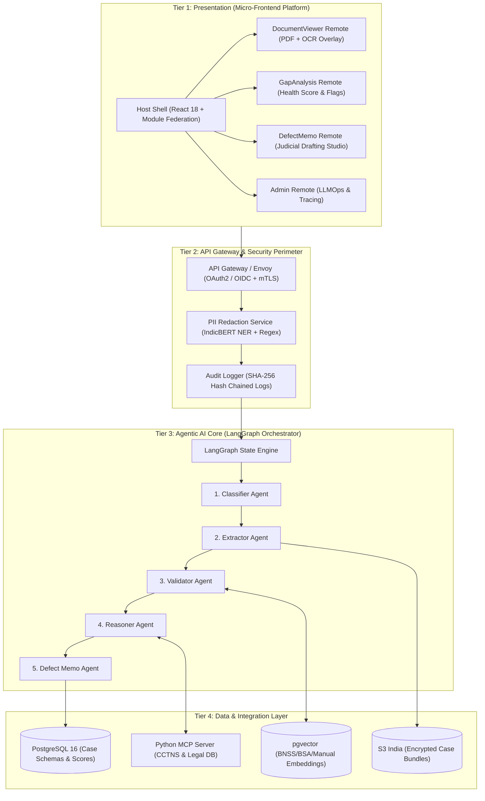
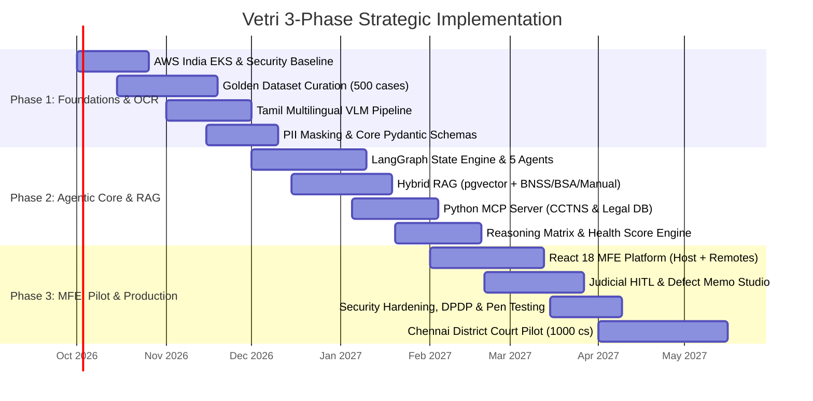

# Vetri (வெற்றி) — Police Cases Report Agent
> *Bridging investigation and judicial scrutiny through intelligent, bilingual document analysis.*

[](#)
[](#)
[](#)
[](#)
[](#)

---

## 📌 Executive Summary

**Vetri (வெற்றி)** (`vetri-police-cases-report-agent`) is an enterprise-grade, government-compliant, bilingual (Tamil + English) Agentic AI platform designed to automate the procedural scrutiny, gap detection, contradiction analysis, and defect memo drafting for police investigation dossiers submitted to judicial magistrates and district courts across Tamil Nadu.

Operating under the modern criminal jurisprudence (**Bharatiya Nagarik Suraksha Sanhita 2023 [BNSS]**, **Bharatiya Sakshya Adhiniyam 2023 [BSA]**, **Bharatiya Nyaya Sanhita 2023 [BNS]**), the **Tamil Nadu Police Manual**, and the **Digital Personal Data Protection Act 2023 (DPDP)**, Vetri transforms a weeks-long manual triage workflow into a 5-minute auditable verification loop with strict Human-in-the-Loop (HITL) judicial safeguards.

---

## 🎯 Key Capabilities

- **Bilingual Multimodal OCR (Tamil + English)**: Visual-language layout understanding (`Qwen2.5-VL`) extracting handwritten Tamil, typed records, and seal stamps with exact token-level bounding-box coordinates.
- **Agentic Procedural Scrutiny**: 5 specialized agents (Classifier $\rightarrow$ Extractor $\rightarrow$ Validator $\rightarrow$ Reasoner $\rightarrow$ Defect Memo) orchestrated via LangGraph.
- **Hybrid Statutory RAG Engine**: Grounded in BNSS, BSA, BNS 2023, and the Tamil Nadu Police Manual using `pgvector` hybrid search with zero-hallucination citation enforcement.
- **Standardized Model Context Protocol (MCP)**: JSON-RPC tool integration with state law enforcement databases (CCTNS/ICJS), Madras High Court rulings, and forensic lab status APIs.
- **Micro-Frontend Presentation Platform**: React 18 + Webpack 5 Module Federation platform serving customized views for Investigating Officers (IOs), Court Clerks, and Judicial Magistrates.
- **Comprehensive Case Health Scoring**: Radial completeness gauge with category-wise breakdown (Completeness, Procedural, Evidential, Timeline) and interactive PDF jump-to-source navigation.
- **DPDP Act 2023 Compliance**: India-only data residency (`ap-south-1` Mumbai), inline `IndicBERT-NER` PII scrubbing, and SHA-256 cryptographic audit trails.

---

## 🛠️ Technology Stack

| Layer | Technology | Purpose |
|---|---|---|
| **Presentation (Frontend)** | React 18, TypeScript, Webpack 5 Module Federation, RxJS, Tailwind CSS | Micro-Frontend host shell and remotes |
| **Agentic AI Core** | Python 3.11+, LangGraph, LangChain, Pydantic v2 | Multi-agent state orchestration & workflows |
| **Multimodal VLM & OCR** | `Qwen2.5-VL-7B-Instruct` / `Qwen2-VL-72B`, IndicBERT | Bilingual Tamil/English visual extraction |
| **RAG & Knowledge Base** | `pgvector` (PostgreSQL 16), LlamaIndex, `bge-multilingual-gemma2`, `bge-reranker-large` | Statutory rule retrieval & grounding |
| **Tool Integration** | Python Model Context Protocol (MCP) Server | CCTNS, High Court precedents, FSL status |
| **Database & Storage** | Amazon RDS PostgreSQL 16 Multi-AZ, Amazon S3 (KMS CMK), Redis | Relational data, encrypted PDFs, sessions |
| **Infrastructure & Cloud** | AWS India (`ap-south-1`), Amazon EKS (CPU + GPU nodes), Terraform, Helm | Sovereign cloud deployment |
| **LLMOps & Observability** | LangSmith, Arize Phoenix, MLflow, Prometheus, Grafana | Distributed tracing, prompt registry, metrics |

---

## 🏛️ System Architecture Overview



---

## 📁 Repository Structure & Documentation Index

```
vetri-police-cases-report-agent/
├── README.md                                # Root documentation & system overview
├── project-requirement.md                   # Comprehensive master requirement & 3-phase plan
├── docs/                                    # Architectural & statutory specifications
│   ├── 01-PROJECT-VISION.md                 # Problem statement, vision, KPIs, non-goals
│   ├── 02-USE-CASES.md                      # Detailed personas, journeys & acceptance criteria
│   ├── 03-STAKEHOLDERS.md                   # RACI matrix, governance & change management
│   ├── 04-LEGAL-FRAMEWORK.md                # BNSS/BSA/BNS mapping, TN Police Manual, DPDP
│   ├── 05-SYSTEM-ARCHITECTURE.md            # 5-Tier enterprise architecture & data flows
│   ├── 06-AGENTIC-AI-WORKFLOW.md            # LangGraph state machine & agent contracts
│   ├── 07-RAG-PIPELINE.md                   # Hybrid chunking, pgvector, citation grounding
│   ├── 08-MCP-INTEGRATION.md                # Python MCP server & CCTNS/Judicial tools
│   ├── 09-FRONTEND-ARCHITECTURE.md          # Webpack 5 Module Federation & RxJS bus
│   ├── 10-AI-SDLC-LLMOPS.md                 # 5-stage SDLC, golden dataset, eval gates
│   ├── 11-DATA-SCHEMAS.md                   # Production Pydantic & JSON entity schemas
│   ├── 12-SECURITY-COMPLIANCE.md            # DPDP checklist, PII redaction, audit chains
│   ├── 13-EVALUATION-FRAMEWORK.md           # LLM-as-a-Judge rubrics & quality harness
│   ├── 14-PHASED-ROADMAP.md                 # 3-Phase strategic delivery schedule & pilot
│   ├── 15-RISKS-MITIGATIONS.md              # Risk register, heatmap & contingencies
│   └── 16-REFERENCES.md                     # Bare acts, case law & academic bibliography
├── agents/                                  # Agent design documents & execution specs
│   ├── README.md                            # Agent system overview & message passing
│   ├── classifier-agent.md                  # Layout classification & taxonomy engine
│   ├── extractor-agent.md                   # Multimodal Tamil OCR & bounding-box parser
│   ├── validator-agent.md                   # Statutory rule engine & procedural auditor
│   ├── reasoner-agent.md                    # Cross-document contradiction matrix
│   └── defect-memo-agent.md                 # High Court Rule 34 defect notice drafter
├── schemas/                                 # JSON Schema Draft 2020-12 specifications
│   ├── charge-sheet-schema.json.md          # Section 193 BNSS Charge Sheet schema
│   ├── fir-schema.json.md                   # Section 173 BNSS FIR schema
│   ├── witness-statement-schema.json.md     # Section 180 BNSS Witness Statement schema
│   └── case-health-score-schema.json.md     # Scrutiny Health Score & Defect Flags schema
├── frontend/                                # Micro-Frontend UX documentation & views
│   ├── README.md                            # Frontend platform overview & dependencies
│   ├── micro-frontend-modules.md            # Module Federation configs & event contracts
│   ├── judge-dashboard.md                   # Judicial Magistrate scrutiny workspace
│   ├── clerk-triage-view.md                 # Court Clerk automated filing & docketing
│   └── io-pre-submission-qa.md              # Investigating Officer pre-filing audit
└── infra/                                   # Cloud & infrastructure specifications
    ├── README.md                            # Infrastructure overview & sovereignty
    ├── aws-deployment.md                    # AWS India EKS, GPU nodes, Terraform & sizing
    ├── llmops-pipeline.md                   # LangSmith tracing, MLflow & CI/CD workflows
    └── cctns-integration.md                 # CCTNS/ICJS IPsec VPN & mTLS integration
```

---

## ⚡ 3-Phase Strategic Delivery Plan



1. **Phase 1: Ingestion & Multilingual VLM Pipeline (Oct – Nov 2026)**: Cloud infra, 500-case Golden Dataset, `Qwen2.5-VL` Tamil OCR with bounding boxes, and PII redaction.
2. **Phase 2: Agentic Core, Hybrid RAG & MCP Integration (Dec 2026 – Jan 2027)**: 5-agent LangGraph state machine, statutory RAG in `pgvector`, Python MCP server, and contradiction engine.
3. **Phase 3: Micro-Frontend UI, Judicial HITL & Pilot Deployment (Feb – Apr 2027)**: Webpack 5 MFE platform, Judicial Defect Memo studio, Cert-In pen-testing, and 1,000-case shadow pilot across Chennai courts.

---

## 🚀 Quick Start for Developers

### 1. Prerequisites
- Python 3.11+
- Node.js 20+ & npm 10+
- Docker & Docker Compose
- PostgreSQL 16 with `pgvector` extension

### 2. Backend Setup
```bash
# Clone the repository
cd vetri-police-cases-report-agent

# Create virtual environment
python3 -m venv .venv
source .venv/bin/activate

# Install backend dependencies
cd backend
pip install -e ".[dev]"

# Start local FastAPI & LangGraph services
uvicorn app.main:app --reload --port 8000
```

### 3. Frontend Setup (Module Federation)
```bash
cd ../frontend/shell
npm install
npm run start # Starts Shell on http://localhost:3000
```

---
*Authored by: Senior AI Solutions Architect & Engineering Manager | Vetri Project Steering Group*
