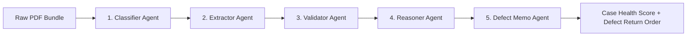

# Vetri Multi-Agent System Core (`agents/`)
## Autonomous Agent Specifications & Orchestration

---

## 1. Overview

The `agents/` module contains the architectural designs, prompt contracts, typed input/output schemas, and execution harnesses for the 5 specialized AI agents powering **Vetri (வெற்றி)**.



---

## 2. Agent Roster

| Agent Document | Primary Role | Underlying Model / Tool | Key Output Artifact |
|---|---|---|---|
| **[classifier-agent.md](file:///Users/apple/projects/tnpolice-case-summary-agent/agents/classifier-agent.md)** | Visual layout analysis and page categorization | `Qwen2.5-VL-7B` | `ClassifiedDocument` list with page spans |
| **[extractor-agent.md](file:///Users/apple/projects/tnpolice-case-summary-agent/agents/extractor-agent.md)** | Multimodal OCR entity extraction with bounding box coordinates | `Qwen2.5-VL` + Tamil Parser | Typed `FIR`, `Mahazar`, `Statement` JSONs |
| **[validator-agent.md](file:///Users/apple/projects/tnpolice-case-summary-agent/agents/validator-agent.md)** | Statutory rule compliance checking against BNSS/BSA/Manual | Deterministic Engine + `pgvector` RAG | `ValidationResult` with statutory pass/fail flags |
| **[reasoner-agent.md](file:///Users/apple/projects/tnpolice-case-summary-agent/agents/reasoner-agent.md)** | Multi-document cross-reference & contradiction detection | Claude 3.5 Sonnet / Indic Legal LLM | `ContradictionMatrix` with side-by-side citations |
| **[defect-memo-agent.md](file:///Users/apple/projects/tnpolice-case-summary-agent/agents/defect-memo-agent.md)** | Drafting court-ready defect notices in High Court format | Claude 3.5 Sonnet + HC Templates | `DefectMemoDraft` (Markdown/PDF) |

---

## 3. Implementation Directory Layout

```
agents/
├── README.md                  # System overview & agent orchestration
├── classifier-agent.md        # Page classification specification & prompt
├── extractor-agent.md         # Multimodal Tamil OCR & bounding-box extraction
├── validator-agent.md         # Deterministic + RAG procedural rule engine
├── reasoner-agent.md          # Cross-document contradiction reasoning
└── defect-memo-agent.md       # Judicial return memo drafting engine
```
