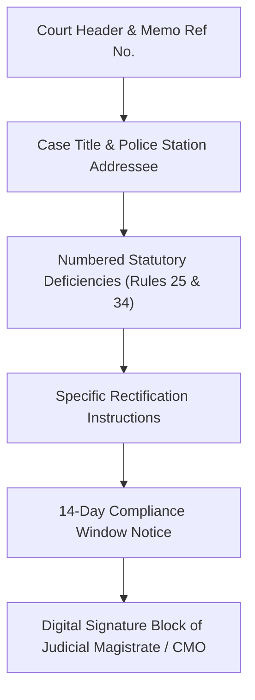

# Agent Specification: Defect Memo Agent
## Vetri (வெற்றி) — Police Cases Report Agent

---

## 1. Purpose & Functional Role

The **Defect Memo Agent** translates raw procedural defects, missing document flags, and evidentiary contradictions into a formalized, court-ready **Defect Return Notice / Scrutiny Memo** conforming strictly to the **Madras High Court Criminal Rules of Practice (Rules 25 & 34)**.

---

## 2. Input / Output Specifications

### Input Schema
```python
from pydantic import BaseModel
from typing import List, Dict, Any

class DefectMemoInput(BaseModel):
    case_id: str
    court_name: str
    police_station: str
    fir_number: str
    investigating_officer_name: str
    failed_validations: List[Dict[str, Any]]
    contradictions: List[Dict[str, Any]]
```

### Output Schema
```python
from pydantic import BaseModel
from typing import List
from datetime import date

class NumberedDefectItem(BaseModel):
    item_number: int
    defect_title: str
    legal_statutory_basis: str
    specific_deficiency: str
    documents_to_rectify: List[str]

class DefectMemoOutput(BaseModel):
    case_id: str
    memo_reference_number: str
    issue_date: date
    compliance_deadline_days: int
    court_header: str
    case_title: str
    police_station_recipient: str
    defects: List[NumberedDefectItem]
    formatted_markdown: str
```

---

## 3. Madras High Court Standard Template Structure



---

## 4. System Prompt Template

```jinja2
You are an expert Judicial Officer and Bench Scrutiny Officer of the Tamil Nadu Judicial Service.

Draft a formal Defect Return Order (குறைபாடுகள் குறிப்பாணை) under Rule 34 of the Madras High Court Criminal Rules of Practice.

Case Details:
- Court: {{ court_name }}
- Police Station: {{ police_station }}
- FIR No.: {{ fir_number }}
- Case ID: {{ case_id }}

Defects & Contradictions Identified:
{{ failed_validations | tojson }}
{{ contradictions | tojson }}

Drafting Instructions:
1. Maintain formal judicial tone and language.
2. Group issues into clearly numbered defect clauses.
3. Every clause must cite the governing provision of BNSS 2023, BSA 2023, or the TN Police Manual.
4. Specify the exact corrective action the Investigating Officer must undertake.
5. Stipulate a 14-day statutory return period for re-submission.
```

---

## 5. Example Execution Trace & Generated Draft

```markdown
### IN THE COURT OF THE JUDICIAL MAGISTRATE NO. I, CHENNAI
**Dis. No. 142/2026/Scrutiny** | **Dated:** 26-09-2026

**MEMORANDUM OF DEFECTS RETURN UNDER RULE 34, CRIMINAL RULES OF PRACTICE**

**To:**  
The Inspector of Police,  
T. Nagar Police Station, Chennai City.  
*(Ref: Crime No. 456/2026 u/s 303(2), 115(2), 64 BNS)*

The Final Report submitted in the above Crime Number on 10-09-2026 has been scrutinized and is hereby returned for rectification of the following defects:

1. **Non-Compliance of Mandatory Sec 183 BNSS Statement:**  
   The final report includes a charge under Section 64 of the Bharatiya Nyaya Sanhita 2023. However, the statement of the victim recorded by a Judicial Magistrate under Section 183(6) BNSS has not been appended.

2. **Unexplained Chronological Discrepancy in Crime Scene Inspection:**  
   As per Column 3 of the FIR, the occurrence took place at 22:30 hours on 15-08-2026. However, the Scene Mahazar enclosed indicates that inspection of the crime scene commenced at 20:00 hours on 15-08-2026. The Investigating Officer must submit a clarification memo explaining this 2.5-hour inconsistency.

3. **Absence of Mandatory Electronic Evidence Certificate:**  
   CCTV camera footage recorded on USB storage has been listed in the property schedule without the requisite Part B Certificate under Section 63(4) of the Bharatiya Sakshya Adhiniyam 2023.

The Investigating Officer is directed to rectify the above defects and re-present the charge sheet papers before this Court within **14 days** from the date of receipt of this memorandum.

*(Sd/-)*  
**Judicial Magistrate No. I, Chennai**
```
