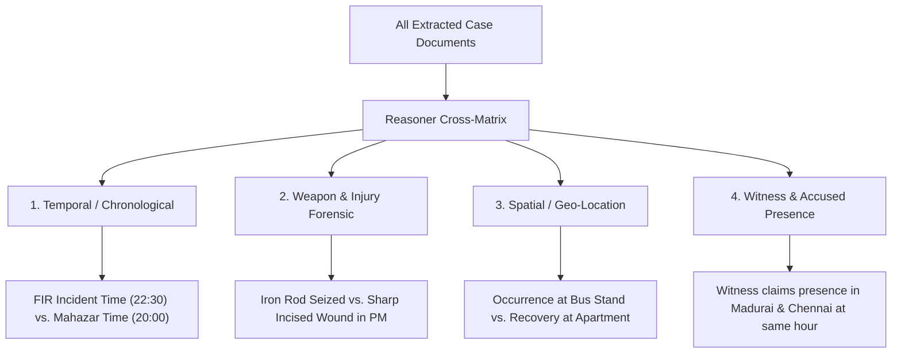

# Agent Specification: Reasoner Agent
## Vetri (வெற்றி) — Police Cases Report Agent

---

## 1. Purpose & Functional Role

The **Reasoner Agent** performs deep cross-document contextual synthesis to uncover factual, temporal, spatial, and evidentiary contradictions across distinct police exhibits. It builds an in-memory chronological event graph and cross-references party assertions to identify flaws that could compromise trial integrity.

---

## 2. Input / Output Specifications

### Input Schema
```python
from pydantic import BaseModel
from typing import Dict, Any, List

class ReasonerInput(BaseModel):
    case_id: str
    extracted_entities: Dict[str, Any]
    validation_results: List[Dict[str, Any]]
```

### Output Schema
```python
from pydantic import BaseModel
from typing import List, Literal, Dict, Any

class ContradictionEvidence(BaseModel):
    document_type: str
    page_number: int
    extracted_claim: str
    bounding_box: Optional[Dict[str, float]] = None

class ContradictionRecord(BaseModel):
    contradiction_id: str
    severity: Literal["critical", "major", "minor"]
    category: Literal[
        "temporal_timeline_clash",
        "weapon_medical_mismatch",
        "spatial_location_conflict",
        "witness_presence_discrepancy"
    ]
    title: str
    narrative_explanation: str
    evidence_a: ContradictionEvidence
    evidence_b: ContradictionEvidence
    suggested_investigation_remedy: str

class ReasonerOutput(BaseModel):
    case_id: str
    contradictions_found: List[ContradictionRecord]
    timeline_coherence_score: float
    evidentiary_consistency_score: float
```

---

## 3. Contradiction Detection Dimensions



---

## 4. System Prompt Template

```jinja2
You are a Senior Criminal Trial Scrutiny Specialist and Judicial Magistrate Law Clerk.

Your duty is to perform cross-document consistency reasoning over the entire police investigation bundle for Case: {{ case_id }}.

Analyze the following extracted exhibits:
1. FIR (Sec 173 BNSS)
2. Scene Mahazar (Sec 105 BNSS)
3. Witness Statements (Sec 180 BNSS)
4. Seizure Mahazar & Form 91
5. Medical / Post-Mortem Certificate

Instructions:
- Construct a chronological timeline of all events (Occurrence, FIR, Dispatch, Search, Seizure, Medical Examination).
- Cross-reference the physical weapon seized against the injury pathology recorded by the medical officer.
- Compare witness presence and locations across statements.
- Flag any genuine factual contradiction with side-by-side citations from Evidence A and Evidence B.
```

---

## 5. Example Execution Trace

```json
{
  "case_id": "TN/CH/2026/001234",
  "timeline_coherence_score": 69.0,
  "evidentiary_consistency_score": 70.0,
  "contradictions_found": [
    {
      "contradiction_id": "CONTRA-2026-001",
      "severity": "major",
      "category": "temporal_timeline_clash",
      "title": "Incident Time Occurred After Scene Inspection Commenced",
      "narrative_explanation": "FIR records the occurrence of theft/assault at 22:30 hrs on 15-Aug-2026. However, the Scene Mahazar states the IO inspected the crime scene at 20:00 hrs on the same day.",
      "evidence_a": {
        "document_type": "FIR_Sec173_BNSS",
        "page_number": 1,
        "extracted_claim": "Date & Time of Occurrence: 15/08/2026 at 22:30 hours"
      },
      "evidence_b": {
        "document_type": "SceneMahazar_Sec105_BNSS",
        "page_number": 3,
        "extracted_claim": "சம்பவ இடப் பார்வை நேரம்: 15/08/2026 மாலை 20:00 மணி"
      },
      "suggested_investigation_remedy": "IO must clarify whether the occurrence time was 20:30 or if Mahazar was prepared on the subsequent day."
    }
  ]
}
```
