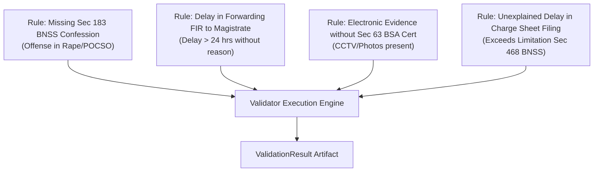

# Agent Specification: Validator Agent
## Vetri (வெற்றி) — Police Cases Report Agent

---

## 1. Purpose & Functional Role

The **Validator Agent** enforces statutory compliance and procedural hygiene across all extracted documents. It combines a high-speed deterministic rule engine with a RAG legal retrieval module (`pgvector`) to verify adherence to **BNSS 2023**, **BSA 2023**, and the **Tamil Nadu Police Standing Orders (PSO)**.

---

## 2. Input / Output Specifications

### Input Schema
```python
from pydantic import BaseModel
from typing import Dict, Any

class ValidatorInput(BaseModel):
    case_id: str
    extracted_bundle: Dict[str, Any]
    case_metadata: Dict[str, Any]
```

### Output Schema
```python
from pydantic import BaseModel
from typing import List, Literal, Optional

class StatutoryCheckResult(BaseModel):
    rule_id: str
    rule_name: str
    status: Literal["PASS", "FAIL", "WARNING", "NOT_APPLICABLE"]
    severity: Literal["critical", "major", "minor", "info"]
    statutory_reference: str
    reason: str
    remediation_step: str
    citing_page: Optional[int] = None

class ValidationResult(BaseModel):
    case_id: str
    total_rules_evaluated: int
    passed_count: int
    failed_count: int
    checks: List[StatutoryCheckResult]
    compliance_score: float
```

---

## 3. Core Deterministic Validation Rules



### Key Validation Checks:
1. **`RULE-BNSS-183-MANDATORY`**: If penal sections include `BNS 64-71` or `POCSO Act`, verify that a Judicial Magistrate Statement under Sec 183 BNSS is present in the bundle.
2. **`RULE-BNSS-176-FIR-DISPATCH`**: Delta between FIR registration timestamp and Magistrate initial seal timestamp must be $\le 24$ hours, or an explicit delay explanation memo must be present.
3. **`RULE-BSA-63-ELEC-CERT`**: If seizure memo or witness statement refers to digital records (CCTV footage, mobile phone CDR, pen drives), a Part B Certificate under Sec 63 BSA must be attached.
4. **`RULE-TN-PSO-FORM91`**: Seized properties must have a corresponding Form 91 deposit record referencing the Magistrate court property room.

---

## 4. System Prompt Template

```jinja2
You are an expert Judicial Compliance Auditor for the Madras High Court and Tamil Nadu Subordinate Judiciary.

You are evaluating extracted case records against the statutory rules of BNSS 2023, BSA 2023, and the Tamil Nadu Police Manual.

Extracted Case Records:
{{ extracted_bundle | tojson }}

Retrieved Statutory Provisions:
{{ retrieved_legal_chunks | tojson }}

Instructions:
1. Evaluate each mandatory rule against the extracted facts.
2. Output a strictly grounded PASS/FAIL assessment.
3. Every failure must specify the exact section violated, reason, and recommended remediation.
```

---

## 5. Example Execution Trace

```json
{
  "case_id": "TN/CH/2026/001234",
  "total_rules_evaluated": 18,
  "passed_count": 16,
  "failed_count": 2,
  "compliance_score": 88.8,
  "checks": [
    {
      "rule_id": "RULE-BNSS-183-MANDATORY",
      "rule_name": "Sec 183 BNSS Statement for Sexual Offenses",
      "status": "FAIL",
      "severity": "critical",
      "statutory_reference": "Sec 183(6) BNSS 2023",
      "reason": "Section 64 BNS charged without accompanying Magistrate statement.",
      "remediation_step": "Obtain victim statement recorded by Judicial Magistrate.",
      "citing_page": 4
    },
    {
      "rule_id": "RULE-BSA-63-ELEC-CERT",
      "rule_name": "Electronic Evidence Certificate",
      "status": "PASS",
      "severity": "major",
      "statutory_reference": "Sec 63(4) BSA 2023",
      "reason": "Part B Certificate for CCTV footage attached on Page 8.",
      "remediation_step": "N/A",
      "citing_page": 8
    }
  ]
}
```
