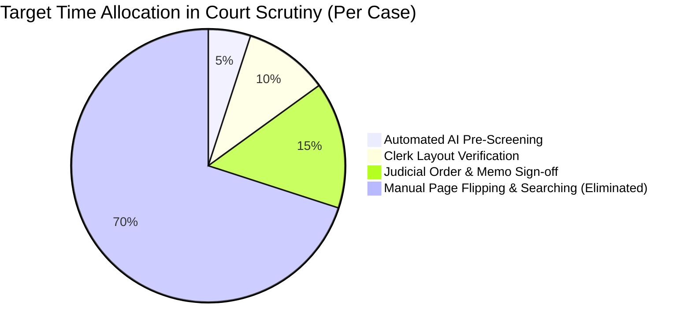
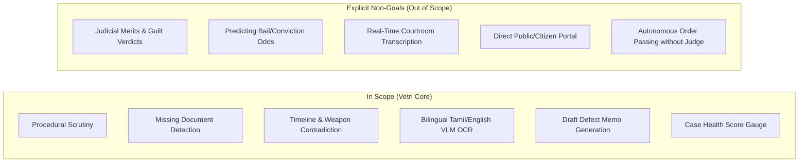

# 01 — Project Vision & Strategic Intent
## Vetri (வெற்றி) — Police Cases Report Agent

---

## 1. Executive Problem Statement

The criminal justice system in Tamil Nadu processes hundreds of thousands of police investigation dossiers annually across judicial magistrate courts, sessions courts, and the Madras High Court. 

With the enactment of India’s modern criminal jurisprudence — the **Bharatiya Nagarik Suraksha Sanhita 2023 (BNSS)**, the **Bharatiya Sakshya Adhiniyam 2023 (BSA)**, and the **Bharatiya Nyaya Sanhita 2023 (BNS)** (effective July 1, 2024) — along with the **Digital Personal Data Protection Act 2023 (DPDP)**, the legal standards for investigation documentation, electronic evidence certification, and mandatory procedural compliance have risen dramatically.

However, the reality at police stations and court registries remains encumbered by manual overhead:
1. **Procedural Non-Compliance**: Over 32% of charge sheets submitted to magistrates exhibit critical defects (e.g., lack of Sec 183 BNSS Magistrate Confessions in heinous offenses, missing electronic evidence certificates under Sec 63 BSA, or delays violating Sec 176 BNSS).
2. **Delayed Judicial Scrutiny**: Court clerks and magistrates take weeks to manually audit voluminous case bundles (often 50–300 pages). Defect memos are served back to Investigating Officers (IOs) weeks later, stalling trial commencements.
3. **Bilingual & Handwritten Complexity**: More than 70% of lower-court case records are handwritten in Tamil, replete with regional administrative jargon, semi-structured mahazar notes, and code-mixed Tanglish terms.
4. **Evidentiary Contradictions**: Mismatches between FIR incident times, General Diary (GD) dispatches, witness statements under Sec 180 BNSS, and seizure lists go unnoticed until the trial stage, resulting in compromised prosecutions.

---

## 2. Vision & Mission

### Vision
> To establish a state-of-the-art, trustworthy, and auditable Agentic AI platform that empowers judicial officers, court staff, and police investigators with instant, bilingual procedural scrutiny — reducing case triage from weeks to minutes while upholding constitutional safeguards and absolute human-in-the-loop judicial sovereignty.

### Mission
- **Intelligent Ingestion**: Decode handwritten Tamil, printed English, and mixed-language police files with high-fidelity visual layout awareness and token-level bounding box coordinates.
- **Statutory Verification**: Deterministically validate all submitted evidence against BNSS 2023, BSA 2023, BNS 2023, and the Tamil Nadu Police Manual.
- **Cross-Document Reasoning**: Uncover temporal, spatial, and evidentiary contradictions across distinct case exhibits.
- **Automated Judicial Drafting**: Formulate standardized, court-ready Defect Memos referencing exact Madras High Court practice rules and statutory provisions.
- **Strict Privacy & DPDP Compliance**: Redact personally identifiable information (PII) before model reasoning, maintaining an immutable audit log within India’s data boundary.

---

## 3. Success Metrics & Key Performance Indicators (KPIs)

| Metric | Industry Baseline (Manual) | 6-Month Pilot Target | 12-Month State-wide Target | Strategic Impact |
|---|---|---|---|---|
| **Charge Sheet Completeness Rate** | ~68% | 85% | $\ge 94\%$ | Eliminates avoidable procedural acquittals |
| **Defect Memo Turnaround Time** | 14–21 Days | 24 Hours | $\le 2$ Hours | Prevents pre-trial detention bottlenecks |
| **Clerk Triage Time per Bundle** | 40 Minutes | 12 Minutes | $\le 5$ Minutes | 8x increase in court registry productivity |
| **AI Gap Detection Precision** | N/A | 88% | $\ge 92\%$ | High trust in flagged procedural defects |
| **AI Gap Detection Recall** | N/A | 85% | $\ge 90\%$ | Ensures no fatal procedural flaw is missed |
| **Legal Citation Hallucination** | N/A | < 1% | **0.0%** | Guaranteed through deterministic RAG grounding |
| **DPDP / PII Breach Incidents** | N/A | 0 | **0** | Strict India-only residency & NER scrubbing |

---

## 4. Scope & Non-Goals

### Explicit Non-Goals (Boundaries of the AI System)
1. **No Autonomous Adjudication**: Vetri shall never determine guilt, innocence, or assess the subjective credibility of a witness. The system provides procedural and evidential *hygiene audits* only.
2. **No Outcome Prediction**: The system will not calculate "conviction probabilities" or offer predictive legal scoring on judicial outcomes.
3. **No Unsupervised Actions**: No defect memo or judicial return order can be served to the police without affirmative review and digital authorization by the presiding Judicial Magistrate or Court Clerk.

---

## 5. Architectural Guiding Principles

1. **AI as Assistant, Not Authority**: Every detected gap or contradiction is accompanied by an exact citation (document type, page number, and visual bounding box overlay).
2. **Explainability Over Black-Box Confidence**: Pure statistical confidence is backed by statutory references from the BNSS/BSA bare acts and the TN Police Manual.
3. **Privacy by Design**: Automated PII masking (Aadhaar, contact info, sensitive victim identifiers under BNS Sec 72) executes before any vector indexing or LLM inference.
4. **Progressive Disclosure**: Present high-level Case Health Scores for rapid triage, while providing deep drill-downs into raw documents for comprehensive judicial scrutiny.
