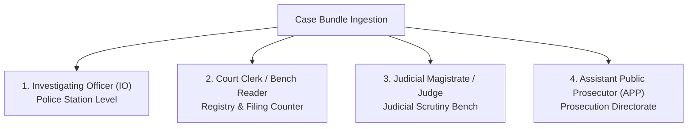
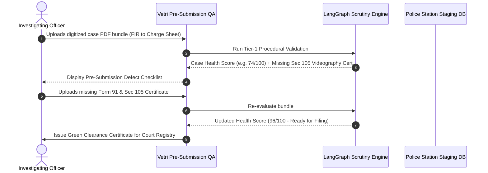
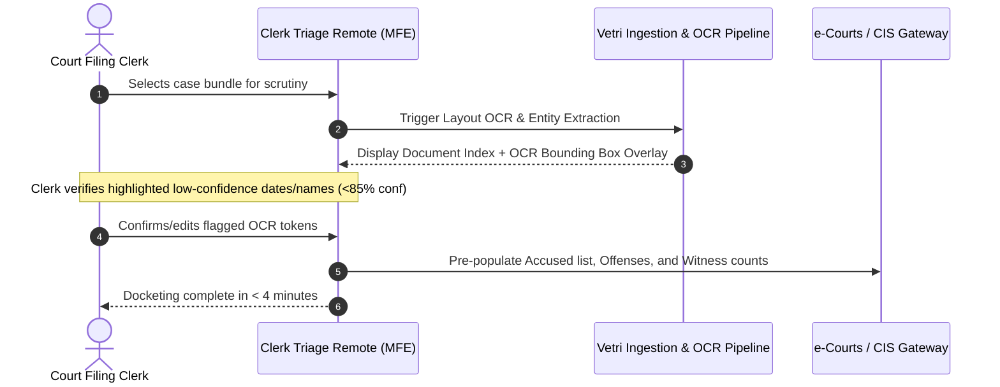
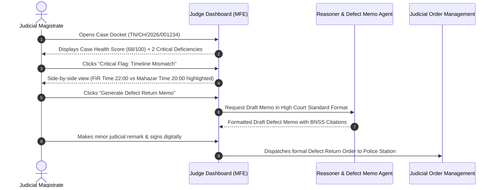
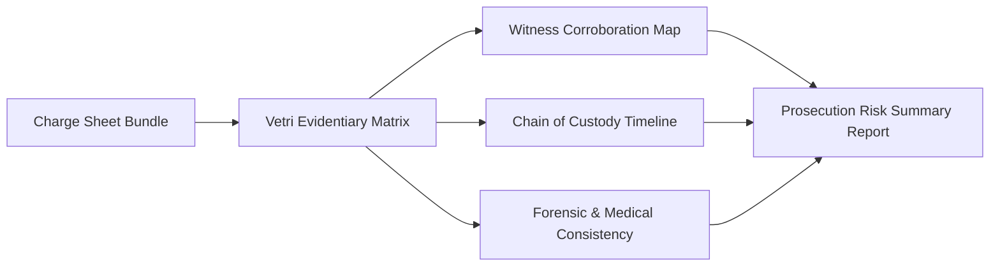

# 02 — User Personas & Use Case Specifications
## Vetri (வெற்றி) — Police Cases Report Agent

---

## 1. Persona Matrix

---

## 2. Deep-Dive Use Case Specifications

### Use Case 1: Investigating Officer (IO) — Pre-Submission QA

| Attribute | Specification |
|---|---|
| **Primary Actor** | Sub-Inspector / Inspector of Police (Investigating Officer, TN Police) |
| **Current Pain Point** | Physical submission of charge sheets often results in embarrassing defect returns weeks later due to missing mandatory annexures (e.g., FSL report requisition, Sec 105 BNSS videography certificate, or delay explanation). |
| **Vetri AI Solution** | Self-service web interface where the IO uploads the digitized case bundle prior to court submission. Vetri runs instantaneous procedural validation, highlighting missing attachments and statutory timeline issues. |
| **Frequency** | 10–25 times per month per police station. |

#### Acceptance Criteria:
- System returns initial pre-submission health audit within 60 seconds for bundles up to 100 pages.
- Flags all missing mandatory documents specified under Chapter XII of the TN Police Manual.
- Generates a timestamped "Pre-Submission Verification Summary" printable by the IO.

---

### Use Case 2: Court Clerk — Automated Docketing & Filing Triage

| Attribute | Specification |
|---|---|
| **Primary Actor** | Bench Reader / Chief Ministerial Officer (CMO) / Filing Clerk |
| **Current Pain Point** | Hundreds of physical pages must be verified for correct pagination, FIR section alignment with Charge Sheet, witness count matching 180 statements, and property schedule consistency. Takes 40+ minutes per case. |
| **Vetri AI Solution** | Automated document categorization, OCR verification, and structured entity extraction. Automatically populates CIS (Case Information System) metadata fields and creates a visual filing audit checklist. |
| **Frequency** | 20–60 case bundles daily at the filing counter. |

#### Acceptance Criteria:
- Automatic classification of multi-page bundles into individual documents (FIR, Mahazar, 180 Statements, Medical Reports) with $\ge 96\%$ accuracy.
- Bounding-box highlight on hover for every extracted field in the side-by-side PDF viewer.
- Direct JSON export compatible with e-Courts CIS 3.2 schema.

---

### Use Case 3: Judicial Magistrate / Judge — Judicial Scrutiny & Gap Analysis

| Attribute | Specification |
|---|---|
| **Primary Actor** | Judicial Magistrate / Sessions Judge |
| **Current Pain Point** | Identifying subtle evidentiary contradictions (e.g., weapon in post-mortem vs. weapon seized, or 2-hour unexplained delay in FIR dispatch) requires reading hundreds of handwritten pages under tight time constraints. |
| **Vetri AI Solution** | High-level Judicial Dashboard showing the Case Health Score, grouped defect flags (Critical, Major, Minor), and a pre-drafted Defect Return Memo ready for judicial edit and digital signature. |
| **Frequency** | Daily during cognizance and preliminary scrutiny sessions. |

#### Acceptance Criteria:
- 100% of defect flags link directly to exact document pages, bounding boxes, and statutory sections.
- Draft Defect Memo generated in compliant Madras High Court format with zero hallucinated section numbers.
- One-click approval or modification workflow for judicial officers.

---

### Use Case 4: Assistant Public Prosecutor (APP) — Case Strength & Evidentiary Risk Analyzer

| Attribute | Specification |
|---|---|
| **Primary Actor** | Assistant Public Prosecutor / Public Prosecutor |
| **Current Pain Point** | Evaluating charge sheets before trial to identify evidentiary vulnerabilities that defense counsel could exploit (e.g., absence of independent witnesses in search mahazar under Sec 105 BNSS). |
| **Vetri AI Solution** | Evidentiary matrix analyzing witness corroboration, chain-of-custody gaps, and forensic consistency before framing of charges. |
| **Frequency** | Prior to cognizance arguments and charge framing hearings. |

#### Acceptance Criteria:
- Maps all witness statements under Sec 180 BNSS against specific accused overt acts.
- Flags uncorroborated material facts and chain of custody gaps in property seized.
