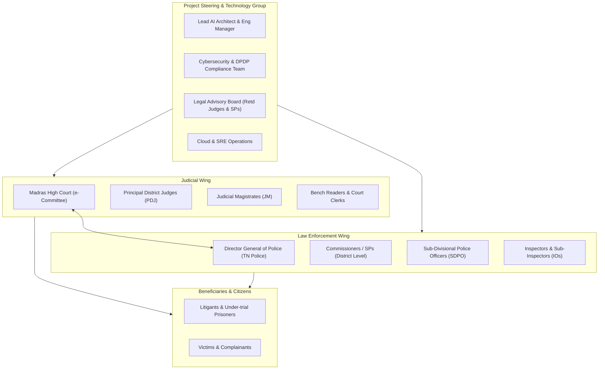
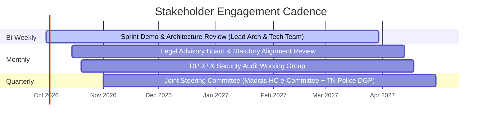

# 03 — Stakeholder Ecosystem, RACI Matrix & Governance
## Vetri (வெற்றி) — Police Cases Report Agent

---

## 1. Stakeholder Landscape & Ecosystem Map

---

## 2. Comprehensive RACI Governance Matrix

| Lifecycle Activity | Lead AI Architect | Legal Advisory Board | Madras HC e-Committee | TN Police DGP Liaison | Judicial Officers (JMs) | Court Clerks | Sec & DPDP Lead |
|---|---|---|---|---|---|---|---|
| **Statutory Rule Definition (BNSS/BSA/BNS)** | **C** | **A / R** | **C** | **C** | **I** | **I** | **I** |
| **Golden Dataset Anonymization & Annotation** | **A / R** | **C** | **I** | **C** | **I** | **R** | **A** |
| **VLM OCR & Agent Architecture** | **A / R** | **C** | **I** | **I** | **I** | **I** | **C** |
| **RAG Knowledge Base & Prompt Engineering** | **R** | **A** | **C** | **C** | **I** | **I** | **C** |
| **Micro-Frontend UI/UX Design** | **A / R** | **I** | **C** | **C** | **C** | **R** | **I** |
| **DPDP Compliance & Pen-Testing Sign-off** | **R** | **C** | **A** | **C** | **I** | **I** | **A / R** |
| **Chennai District Pilot Execution** | **A / R** | **C** | **A** | **A** | **R** | **R** | **C** |
| **State-wide Rollout & Policy Adoption** | **C** | **I** | **A** | **A** | **R** | **R** | **I** |

*Legend: **R** = Responsible, **A** = Accountable, **C** = Consulted, **I** = Informed.*

---

## 3. Stakeholder Communication & Engagement Cadence

### Communication Channels:
1. **Executive Steering Committee (Quarterly)**: Review KPI realization, pilot feedback, and statewide policy integration.
2. **Technical & Legal Working Group (Bi-Weekly)**: Review edge-case procedural rules, multilingual OCR accuracy, and prompt safety metrics.
3. **Court User Feedback Loops (Weekly during Pilot)**: Structured feedback sessions with court clerks and magistrates on UI ergonomics, false flag rates, and triage latency.

---

## 4. Change Management & Judicial Training Plan

To prevent adoption friction and ensure constitutional trust:
- **Phase A (Orientation)**: Hands-on workshops at the Tamil Nadu State Judicial Academy (TNSJA) demonstrating the "AI as Assistant" model and the strict bounding-box citation mechanism.
- **Phase B (Police Station Training)**: Training Investigating Officers across pilot police sub-divisions on digital scanning standards, Sec 105 BNSS electronic evidence procedures, and pre-submission QA tools.
- **Phase C (Clerk Certification)**: Standard Operating Procedure (SOP) training for Bench Readers on rapid OCR verification and automated CIS docketing.
