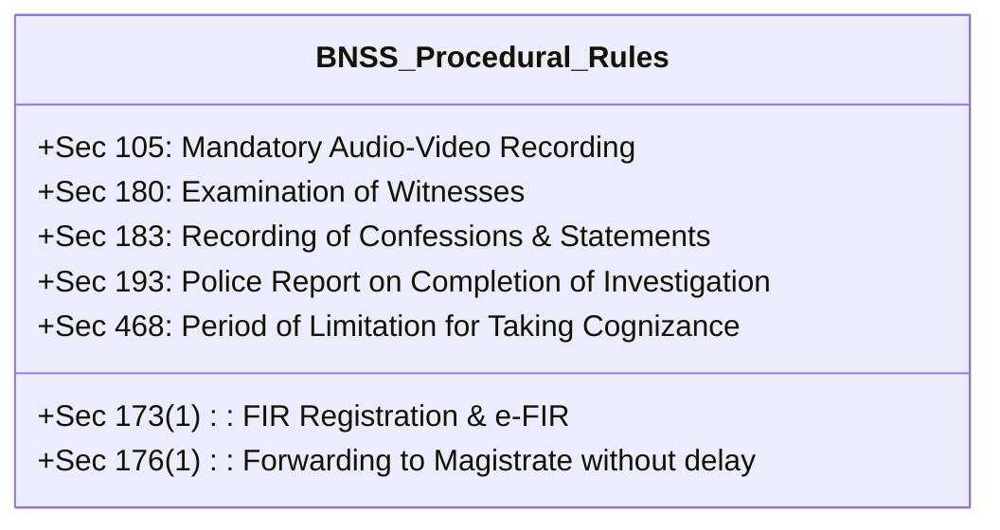
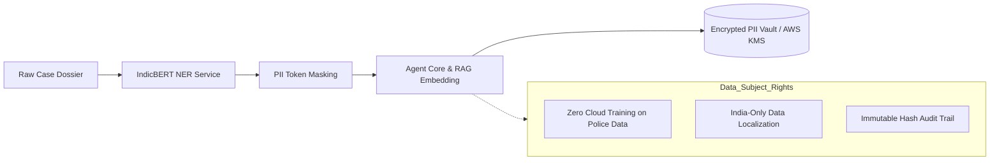

# 04 — Statutory & Legal Framework Specification
## Vetri (வெற்றி) — Police Cases Report Agent

---

## 1. Indian Criminal Jurisprudence Transformation (Effective July 1, 2024)

Vetri operates in a hybrid transition era where offenses committed prior to July 1, 2024 follow legacy statutes (**CrPC 1973**, **IPC 1860**, **IEA 1872**), while all offenses committed on or after July 1, 2024 are governed strictly by the new criminal codes (**BNSS 2023**, **BNS 2023**, **BSA 2023**).

```mermaid
graph TD
    DOC[Incident Date Extracted from FIR] --> DATE_CHECK{Date < July 1, 2024?}
    DATE_CHECK -- Yes --> LEGACY[Legacy Legal Engine: IPC / CrPC / IEA]
    DATE_CHECK -- No --> MODERN[Modern Legal Engine: BNS / BNSS / BSA]
    
    LEGACY --> SCH1[CrPC Sec 173(2) Charge Sheet Rules]
    MODERN --> SCH2[BNSS Sec 193 Charge Sheet Rules + Sec 105 Audio-Video]
```

---

## 2. Key Statutory Provisions & AI Scrutiny Rules

### 2.1 Bharatiya Nagarik Suraksha Sanhita 2023 (BNSS)



| BNSS Section | Legal Mandate | Vetri AI Automated Scrutiny Engine Trigger |
|---|---|---|
| **Sec 173** | Information in cognizable cases (FIR). | Verify police station jurisdiction, complainant signature presence, and initial penal sections. |
| **Sec 176(1)** | Immediate dispatch of FIR to Magistrate. | Compare FIR registration timestamp vs. Magistrate court initial seal timestamp. Flags delays $> 24$ hours without explicit explanation. |
| **Sec 105** | Mandatory audio-video electronic recording of search, seizure, and crime scene inspection. | Verify presence of electronic media hash, seizure videography certificate, and independent witness attestation. |
| **Sec 180** | Police examination of witnesses (erstwhile 161 CrPC). | Check that witness statements are individual (not composite/joint), dated, signed by IO, and un-coerced. |
| **Sec 183** | Judicial Magistrate recording of confessions and statements (erstwhile 164 CrPC). | **Mandatory Trigger**: If offenses under BNS Sec 64–71 (Rape/Sexual Offenses) or POCSO are charged, absence of Sec 183 statement raises a **CRITICAL DEFECT**. |
| **Sec 193** | Final police report / Charge Sheet (erstwhile 173(2) CrPC). | Full 13-column schema validation: names of parties, nature of information, offenses charged, arrest date, custody/bail status, property seized, and FSL annexures. |
| **Sec 468** | Bar to taking cognizance after period of limitation. | Calculates delta between date of offense and date of filing. If offense punishment $< 1$ yr and delay $> 1$ yr (or 3 yrs for offenses up to 3 yrs), flags limitation bar. |

---

### 2.2 Bharatiya Sakshya Adhiniyam 2023 (BSA)

| BSA Section | Subject Matter | Vetri Validation Check |
|---|---|---|
| **Sec 23** | Confessions made to police officers not to be proved. | Scans 180 statements and charge sheet narrative. Flags any inadmissible confession made in police custody without recovery under Sec 23(2). |
| **Sec 61–63** | Admissibility of Electronic Records & Mandatory Certificate (erstwhile 65B IEA). | For any digital evidence (CCTV, call data records [CDR], mobile extractions, Sec 105 videography), validates the inclusion of the statutory **Part B Electronic Certificate** signed by the device custodian. |
| **Sec 45** | Opinions of Experts (Forensic & Medical). | Cross-checks medical injury description against weapon characteristics recorded in the seizure mahazar. |

---

### 2.3 Bharatiya Nyaya Sanhita 2023 (BNS) & Transition Crosswalk

Vetri maintains an internal bi-directional semantic crosswalk:

| Offense Category | Legacy IPC Section | Modern BNS 2023 Section | Essential Ingredients Verified by Vetri |
|---|---|---|---|
| **Theft** | Sec 379 IPC | **Sec 303(2) BNS** | Dishonest intention, movable property, taken out of possession without consent, seizure memo present. |
| **Robbery / Dacoity** | Sec 392 / 395 IPC | **Sec 309 / 310 BNS** | Offense committed with threat of death/hurt; recovery memo under Sec 105 BNSS. |
| **Voluntarily Causing Hurt** | Sec 323 / 324 IPC | **Sec 115(2) / 117 BNS** | Wound certificate from Registered Medical Practitioner within 48 hours of occurrence. |
| **Culpable Homicide / Murder** | Sec 302 IPC | **Sec 103 BNS** | Post-Mortem certificate, inquest report (Sec 194 BNSS), RFSL chemical analysis report. |
| **Sexual Offenses** | Sec 376 IPC | **Sec 64 BNS** | Sec 183 BNSS statement, victim medical report (Sec 184 BNSS), DNA profiling status. |

---

## 3. Tamil Nadu Police Manual & Madras High Court Rules

### 3.1 Tamil Nadu Police Manual (Volumes 1 & 2)
- **Order No. 562 (Crime Scene Investigation)**: Requires IO to prepare the Scene Mahazar on the spot with two respectable independent witnesses of the locality.
- **Order No. 588 (Case Diary Maintenance)**: Daily General Diary (GD) entries must chronologically align with every outward movement and witness examination.
- **Form 91 (Property Disposal Form)**: All seized articles must be deposited in the Magistrate's property room within 48 hours of seizure.

### 3.2 Madras High Court Criminal Rules of Practice (2019 Amendments)
- **Rule 25 (Scrutiny of Final Reports)**: Prescribes standard checklist of 22 items to be verified by the Court Registry prior to taking cognizance.
- **Rule 34 (Return of Defective Papers)**: Mandates that all defects be clearly cataloged with specific rule citations and a strict compliance window (usually 14 days) given to the IO.

---

## 4. Digital Personal Data Protection Act 2023 (DPDP)



1. **Section 3 & 4 (Lawful Purpose & Processing)**: Processing is strictly restricted to sovereign judicial and law enforcement scrutiny functions.
2. **Section 8 (Data Security Safeguards)**:
   - Mandatory automated masking of: Aadhaar numbers, bank account numbers, personal contact numbers, and rape/POCSO victim identities.
   - Zero retention of decrypted PII in vector indexes or external LLM caching tiers.
   - All underlying model inferences execute within AWS India (`ap-south-1`) VPC boundaries.
