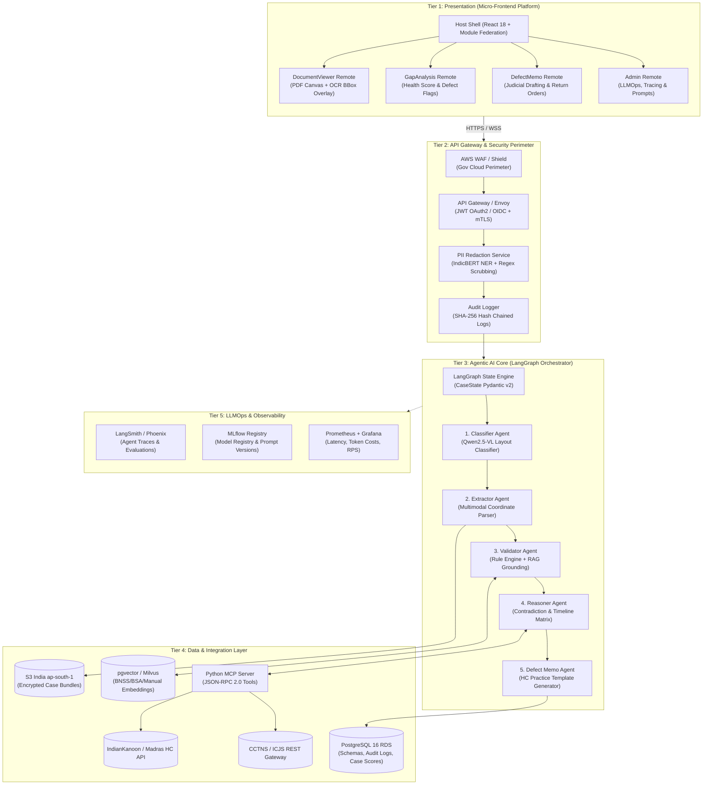
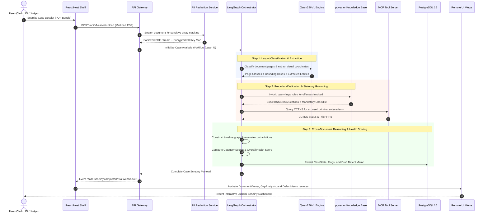
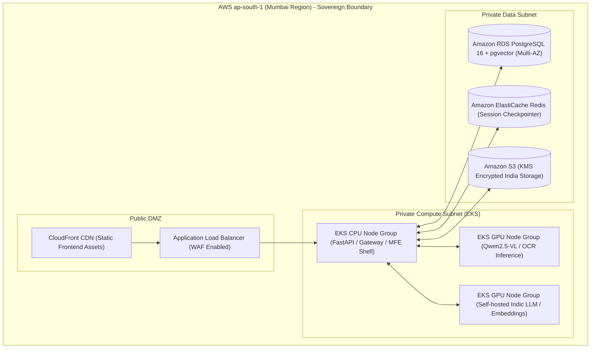

# 05 — End-to-End System Architecture Blueprint
## Vetri (வெற்றி) — Police Cases Report Agent

---

## 1. 5-Tier Enterprise Architecture Overview

---

## 2. End-to-End Data Flow Pipeline

---

## 3. Tier-by-Tier Component Specifications

### 3.1 Tier 1: Presentation Layer (Micro-Frontend Architecture)
- **Host Shell (`@vetri/shell`)**: Orchestrates authentication, session refresh, RBAC gatekeeping, and dynamic loading of remotes via Webpack 5 Module Federation.
- **DocumentViewer Remote (`@vetri/document-viewer`)**: Canvas-rendered dual-page PDF viewer with real-time bounding-box highlighting synchronized with active defect flags.
- **GapAnalysis Remote (`@vetri/gap-analysis`)**: Visual Case Health Score gauge (0–100) with category-wise breakdown (Completeness, Procedural, Evidential, Timeline) and interactive filter chips.
- **DefectMemo Remote (`@vetri/defect-memo`)**: Specialized drafting studio containing pre-populated High Court defect return templates, rich-text markdown editing, and digital signature integration.
- **Admin Remote (`@vetri/admin`)**: Real-time observability dashboard displaying LangSmith trace links, token budget consumption, and prompt experimentation toggles.

### 3.2 Tier 2: API Gateway & Security Perimeter
- **Envoy / AWS API Gateway**: Terminating mutual TLS (mTLS), applying rate limiting (100 req/min/IP), and enforcing OAuth2/OIDC JWT tokens issued by state judicial identity providers.
- **PII Scrubbing Service**: High-speed NER model (`IndicBERT-NER`) running inline to redact Aadhaar numbers (12 digits), phone numbers, bank details, and victim identities prior to vector embedding.
- **Immutable Audit Service**: Every document upload, inference step, prompt hash, and judicial override is cryptographically chained using SHA-256 hashes and stored in an append-only audit table.

### 3.3 Tier 3: Agentic AI Core (LangGraph)
- Built on Python 3.11+ using `langgraph>=0.2.50` and `pydantic>=2.9.0`.
- Implements a resilient StateGraph architecture with checkpoints, cyclic feedback edges for human verification, and automatic fallback routers.

### 3.4 Tier 4: Data & Integration Layer
- **PostgreSQL 16 with pgvector**: Stores high-dimensional embeddings (1536-dim / 3072-dim) of legal statutes alongside relational metadata.
- **AWS S3 (Mumbai `ap-south-1`)**: Stores raw PDFs, processed page image slices, and generated Defect Memo PDFs under server-side KMS encryption (`aws:kms`).
- **Python MCP Server**: Standardized Model Context Protocol server exposing verified tools over JSON-RPC 2.0 for external ecosystem integration.

### 3.5 Tier 5: LLMOps & Observability
- **Tracing & Evaluation**: Native LangSmith / Arize Phoenix integration tracing multi-agent token latency, retrieval relevance, and step-by-step reasoning paths.
- **Registry & Metrics**: MLflow tracking prompt versions and model weights; Prometheus + Grafana capturing latency percentiles (p50, p95, p99) and token spend.

---

## 4. Deployment Topology & India Data Residency

