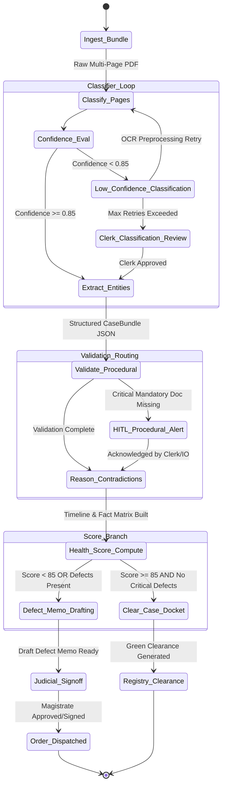

# 06 — Agentic AI Multi-Agent Workflow & LangGraph Engine
## Vetri (வெற்றி) — Police Cases Report Agent

---

## 1. LangGraph State Machine Architecture

The Vetri AI core is designed as a cyclical, state-driven multi-agent system implemented using `LangGraph`. Each agent operates on a strongly-typed `CaseState` schema, passing contextual artifacts forward while supporting conditional routing, automated retries, and Human-in-the-Loop (HITL) intervention checkpoints.



---

## 2. Detailed Agent Specifications

### 2.1 Agent 1: Classifier Agent
- **Purpose**: Page-by-page visual layout analysis and document categorization of the uploaded bundle.
- **Underlying Model**: `Qwen2.5-VL-7B-Instruct` / `Qwen2-VL-72B-Instruct` (Tamil + English vision-language model).
- **Inputs**: Sliced page images (`List[PageImage]`).
- **Outputs**: `ClassifiedDocument` containing document type, confidence score, language detected, and page range.
- **Document Taxonomies Handled**:
  1. `FIR_Sec173_BNSS`
  2. `SceneMahazar_Sec105_BNSS`
  3. `WitnessStatement_Sec180_BNSS`
  4. `Confession_Sec183_BNSS`
  5. `SeizureMahazar_Form91`
  6. `Medical_PostMortem_Report`
  7. `ChargeSheet_Sec193_BNSS`
  8. `ElectronicEvidenceCert_Sec63_BSA`
  9. `Unknown_Annexure`

---

### 2.2 Agent 2: Extractor Agent
- **Purpose**: Perform high-precision multimodal entity extraction with strict bounding-box coordinate tracking (`[ymin, xmin, ymax, xmax]`).
- **Underlying Model**: `Qwen2.5-VL` + fine-tuned Tamil legal parser.
- **Inputs**: `ClassifiedDocument` page slices.
- **Outputs**: Typed Pydantic document schemas (e.g., `FIRSchema`, `WitnessStatementSchema`, `SeizureMemoSchema`).
- **Key Entities Extracted**:
  - Timestamps (Occurrence date/time, FIR registration date/time, Dispatch to Magistrate time).
  - Accused details (Name, Parent name, Age, Gender, Address, Custody/Bail status).
  - Witness details (Name, Father's name, Address, Specific statements made).
  - Offenses & Sections (Statute invoked, description of overt acts).
  - Seized property descriptions, serial numbers, weapon specifications.

---

### 2.3 Agent 3: Validator Agent
- **Purpose**: Execute statutory and procedural compliance checks against BNSS, BSA, BNS, and the Tamil Nadu Police Manual.
- **Underlying Architecture**: Hybrid deterministic rule engine + RAG legal retriever (`pgvector`).
- **Inputs**: `CaseBundle` (all extracted entities) + `CaseMetadata`.
- **Outputs**: `ValidationResult` (List of passed/failed statutory rules with exact legal citations).
- **Core Validation Scenarios**:
  - *Delay Verification*: FIR dispatch to Magistrate within 24 hours under Sec 176 BNSS.
  - *Mandatory Confession Rule*: Verifies existence of Sec 183 BNSS Magistrate statement for POCSO, rape, and heinous assault cases.
  - *Electronic Certificate Rule*: Checks for Sec 63 BSA certificate whenever digital records (CCTV, CDR, photos) are mentioned.
  - *Property Schedule Rule*: Verifies Form 91 deposit in Magistrate court within 48 hours.

---

### 2.4 Agent 4: Reasoner Agent
- **Purpose**: Perform multi-document cross-referencing to uncover temporal, spatial, and evidential contradictions.
- **Underlying Model**: Claude 3.5 Sonnet / GPT-4o with legal reasoning system prompt.
- **Inputs**: Extracted entities from all documents + `ValidationResult`.
- **Outputs**: `ContradictionMatrix` containing verified conflicting pairs with side-by-side citations.
- **Example Reasoning Detections**:
  - *Temporal Conflict*: FIR states crime took place on Aug 15 at 22:00 hrs; Scene Mahazar states inspection commenced on Aug 15 at 19:30 hrs (pre-dating the crime).
  - *Weapon vs. Medical Conflict*: Seizure memo records recovery of a "sharp iron sickle" (வெட்டரிவாள்); Medical post-mortem records cause of death as "blunt-force skull fracture without incised wounds".
  - *Witness Alibi Conflict*: Witness 'A' statements in Sec 180 record presence at crime scene in Chennai; simultaneously listed as an independent witness in a seizure mahazar in Madurai at the same hour.

---

### 2.5 Agent 5: Defect Memo Agent
- **Purpose**: Automatically compile all identified procedural defects, missing documents, and evidentiary contradictions into a formalized, court-ready Defect Return Memo adhering to Madras High Court Criminal Rules of Practice.
- **Underlying Model**: Claude 3.5 Sonnet + High Court Template RAG.
- **Inputs**: `ContradictionMatrix` + `ValidationResult` + `CaseHealthScore`.
- **Outputs**: `DefectMemoDraft` (Markdown & PDF ready for Judicial Magistrate review and digital signature).

---

## 3. Inter-Agent Typed Message Protocol (Pydantic v2)

```python
from typing import List, Dict, Any, Optional, Literal
from pydantic import BaseModel, Field
from datetime import datetime

class PageCoordinate(BaseModel):
    page_num: int
    ymin: float
    xmin: float
    ymax: float
    xmax: float

class ExtractedToken(BaseModel):
    text: str
    confidence: float
    bbox: PageCoordinate

class ClassifiedPage(BaseModel):
    page_number: int
    doc_type: str
    confidence: float
    language: str

class ContradictionItem(BaseModel):
    contradiction_id: str
    severity: Literal["critical", "major", "minor"]
    category: str
    doc_a_citation: Dict[str, Any]
    doc_b_citation: Dict[str, Any]
    analysis_narrative: str
    remediation_required: str

class CaseState(BaseModel):
    case_id: str
    fir_number: str
    police_station: str
    raw_pdf_path: str
    classified_pages: List[ClassifiedPage] = Field(default_factory=list)
    extracted_entities: Dict[str, Any] = Field(default_factory=dict)
    validation_flags: List[Dict[str, Any]] = Field(default_factory=list)
    contradictions: List[ContradictionItem] = Field(default_factory=list)
    health_score: Optional[Dict[str, Any]] = None
    defect_memo_content: Optional[str] = None
    needs_human_review: bool = False
    review_stage: Optional[str] = None
    error: Optional[str] = None
```

---

## 4. Error Handling, Circuit Breakers & Fallback Strategies

| Failure Scenario | Automatic Recovery Strategy | Fallback / HITL Escalation |
|---|---|---|
| **VLM Unreadable Tamil Handwriting** | Apply image contrast enhancement (CLAHE) + multi-pass OCR retry. | Route low-confidence bounding box to Clerk Triage Queue with zoom-in editor. |
| **LLM Inference Timeout / 504** | 3x exponential backoff with jitter ($2s, 4s, 8s$). | Failover to backup self-hosted Indic LLM instance on EKS. |
| **Low Classification Confidence ($<0.75$)** | Re-run with layout boundary detection prompt. | Flag bundle for manual page indexing in Clerk UI. |
| **RAG Retrieval Disconnect** | Fallback to deterministic regex-based rule engine. | Log warning to LangSmith; mark flag as "statutory baseline check". |
| **MCP Tool Failure (e.g. CCTNS)** | Circuit breaker opens; continue case analysis without CCTNS antecedent score. | Annotate Defect Memo: *"External CCTNS check offline — Manual verification recommended"*. |
