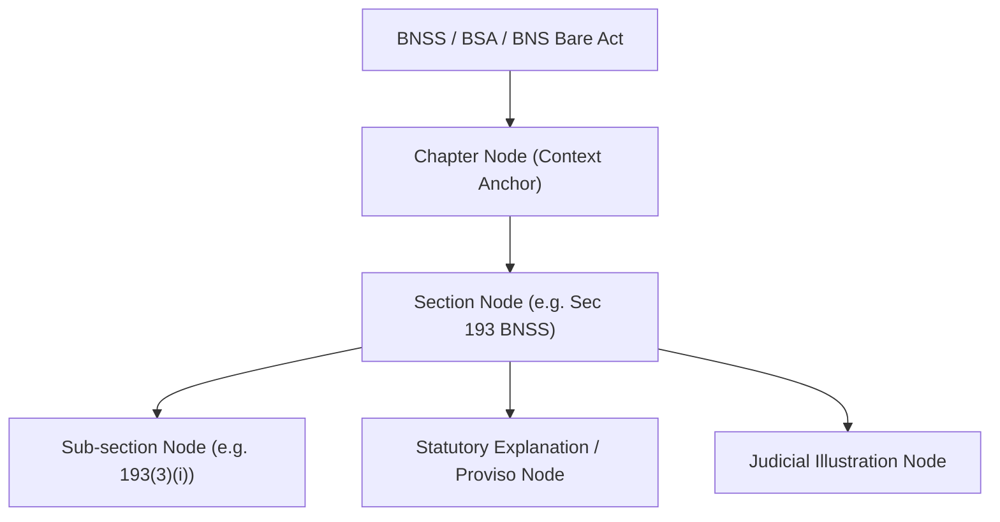
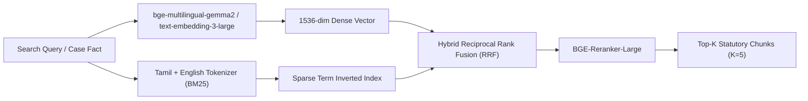

# 07 — RAG Knowledge Engine & Legal Citation Grounding
## Vetri (வெற்றி) — Police Cases Report Agent

---

## 1. Legal Knowledge Corpus & Hierarchical Chunking

Legal statutes (BNSS 2023, BSA 2023, BNS 2023, TN Police Manual) cannot be chunked using naive character-length splits. Legal provisions require **hierarchical, structure-aware semantic chunking** to preserve definitions, statutory explanations, and judicial illustrations.



### Chunking Specification:
- **Chunk Boundary**: Exact Section and Sub-section boundaries.
- **Header Injection**: Every chunk includes contextual metadata:
  ```
  [Act: BNSS 2023] [Chapter: XII - Information to Police and Power to Investigate] [Section: 193 - Report of Police Officer on Completion of Investigation] [Sub-clause: 3(ii)]
  ```
- **Chunk Size**: Target $350 - 600$ tokens with 50-token semantic overlap for lengthy explanations.

---

## 2. Embedding Model Selection & Multilingual Strategy

The legal corpus and case records contain a mixture of **formal legal English**, **pure Tamil legal terminology (e.g., முதல் தகவல் அறிக்கை, புலன்விசாரணை, குற்றப்பத்திரிகை)**, and **colloquial Tanglish police diary entries**.



| Embedding Model | Multilingual Support (Tamil + English) | Dimension | Benchmark NDCG@10 (Legal Domain) | Role in Vetri |
|---|---|---|---|---|
| **BAAI/bge-multilingual-gemma2** | High (State-of-the-art Tamil representation) | 3584 / 1536 | 0.842 | **Primary Dense Retriever** |
| **OpenAI text-embedding-3-large** | High (Robust cross-lingual transfer) | 1536 / 3072 | 0.835 | Secondary Cloud Fallback |
| **IndicBERT-v2 / Sarvam Embedding** | Very High (Native Indic fine-tuned) | 768 | 0.810 | Self-hosted Local Edge Model |
| **BAAI/bge-reranker-large** | Cross-Encoder Multilingual | N/A | 0.891 | **Cross-Encoder Re-ranker** |

---

## 3. Vector Database Schema (PostgreSQL `pgvector`)

```sql
-- Enable pgvector extension
CREATE EXTENSION IF NOT EXISTS vector;

-- Table for Indian Criminal Statutes & Police Manual
CREATE TABLE legal_knowledge_chunks (
    chunk_id UUID PRIMARY KEY DEFAULT gen_random_uuid(),
    act_name VARCHAR(64) NOT NULL,            -- 'BNSS', 'BSA', 'BNS', 'TN_POLICE_MANUAL'
    chapter_num VARCHAR(32),
    section_num VARCHAR(32) NOT NULL,
    sub_section VARCHAR(32),
    marginal_heading TEXT NOT NULL,
    chunk_text TEXT NOT NULL,
    chunk_text_tamil TEXT,                    -- Official Tamil translation
    chunk_vector vector(1536) NOT NULL,
    is_mandatory BOOLEAN DEFAULT FALSE,
    crime_category VARCHAR(64)[],             -- ['THEFT', 'HURT', 'POCSO', 'NDPS']
    created_at TIMESTAMP WITH TIME ZONE DEFAULT NOW()
);

-- Create HNSW Index for ultra-low latency cosine similarity search
CREATE INDEX idx_legal_knowledge_hnsw 
ON legal_knowledge_chunks 
USING hnsw (chunk_vector vector_cosine_ops)
WITH (m = 16, ef_construction = 64);

-- Full-Text Search GIN index for hybrid BM25 retrieval
CREATE INDEX idx_legal_knowledge_fts 
ON legal_knowledge_chunks 
USING gin (to_tsvector('english', chunk_text || ' ' || marginal_heading));
```

---

## 4. Hybrid Retrieval & Re-ranking Algorithm

```python
async def hybrid_legal_retrieval(
    query_text: str,
    crime_type: str,
    top_k: int = 5
) -> List[Dict[str, Any]]:
    """
    Executes dense HNSW vector search combined with full-text search
    and cross-encoder re-ranking.
    """
    # 1. Generate query embedding
    query_vec = await get_embedding(query_text)
    
    # 2. Dense Cosine Retrieval via pgvector
    dense_results = await db.query(
        """
        SELECT chunk_id, act_name, section_num, chunk_text, 
               1 - (chunk_vector <=> :query_vec) AS dense_score
        FROM legal_knowledge_chunks
        WHERE :crime_type = ANY(crime_category) OR crime_category IS NULL
        ORDER BY chunk_vector <=> :query_vec
        LIMIT 20
        """,
        query_vec=query_vec,
        crime_type=crime_type
    )
    
    # 3. Sparse Keyword Retrieval (BM25 / ts_rank)
    sparse_results = await db.query(
        """
        SELECT chunk_id, act_name, section_num, chunk_text,
               ts_rank(to_tsvector('english', chunk_text), plainto_tsquery('english', :query_text)) AS sparse_score
        FROM legal_knowledge_chunks
        WHERE to_tsvector('english', chunk_text) @@ plainto_tsquery('english', :query_text)
        LIMIT 20
        """,
        query_text=query_text
    )
    
    # 4. Reciprocal Rank Fusion (RRF)
    fused_candidates = rrf_merge(dense_results, sparse_results, rrf_k=60)
    
    # 5. Cross-Encoder Re-ranking
    final_ranked_chunks = await cross_encoder_rerank(
        query=query_text,
        candidates=fused_candidates,
        top_k=top_k
    )
    
    return final_ranked_chunks
```

---

## 5. Citation Enforcement & Zero-Hallucination Guardrails

To ensure zero hallucinated legal citations in judicial outputs:
1. **Constrained Prompting**: The LLM is explicitly instructed that it can **ONLY** quote sections returned in the RAG retrieval payload.
2. **Deterministic Post-Validation**: Before rendering any flag in the UI or Defect Memo, a deterministic regex validator checks the generated section string against the known list of valid sections in the `legal_knowledge_chunks` database table.
3. **Bounding Box Binding**: Every factual finding extracted from police documents must retain its page number and visual coordinates (`[ymin, xmin, ymax, xmax]`), ensuring complete traceability for the presiding judge.
