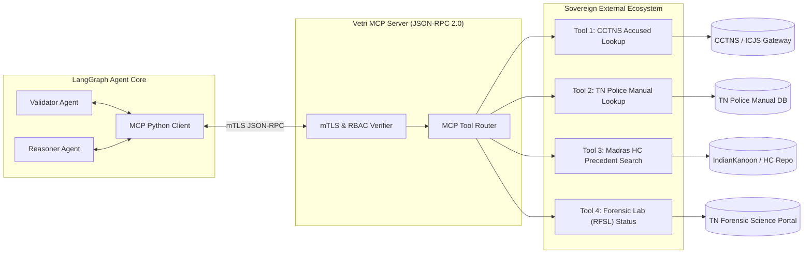
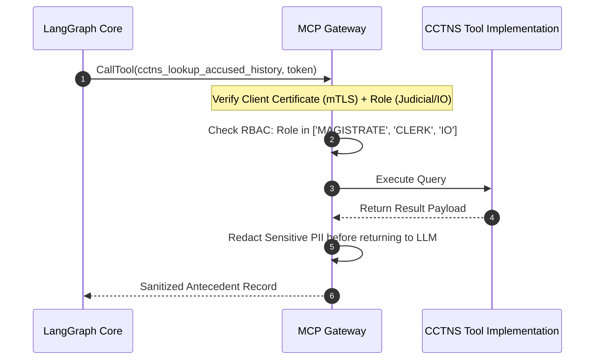

# 08 — Model Context Protocol (MCP) Server Architecture
## Vetri (வெற்றி) — Police Cases Report Agent

---

## 1. MCP Server Overview & Protocol Architecture

Vetri implements the open **Model Context Protocol (MCP)** via a high-performance Python server (`mcp-server-vetri`). This enables the Agentic AI core to interface with state law enforcement databases (CCTNS), judicial repositories (e-Courts / IndianKanoon), forensic status APIs, and internal police manual registries over secure JSON-RPC 2.0 channels.



---

## 2. Standardized Tool Specifications

### Tool 1: `cctns_lookup_accused_history`
- **Description**: Queries state CCTNS (Crime and Criminal Tracking Network & Systems) and ICJS (Inter-operable Criminal Justice System) using Aadhaar/PAN/Name/Father’s Name to retrieve prior criminal antecedents.
- **Input Schema**:
  ```json
  {
    "type": "object",
    "required": ["accused_name", "father_name", "district"],
    "properties": {
      "accused_name": {"type": "string", "description": "Full name of the accused in English or Tamil"},
      "father_name": {"type": "string", "description": "Father/Spouse name"},
      "approx_age": {"type": "integer", "description": "Estimated age"},
      "district": {"type": "string", "description": "Tamil Nadu Police District (e.g. 'Chennai City', 'Madurai')"}
    }
  }
  ```
- **Output Schema**:
  ```json
  {
    "prior_cases_count": 2,
    "has_history_sheet": true,
    "is_proclaimed_offender": false,
    "prior_firs": [
      {
        "fir_number": "112/2023",
        "police_station": "Mylapore PS",
        "sections": ["379 IPC"],
        "disposal_status": "Pending Trial"
      }
    ]
  }
  ```

---

### Tool 2: `tn_police_manual_rule_lookup`
- **Description**: Searches official Tamil Nadu Police Standing Orders (PSOs) and DGP circulars for specific procedural requirements.
- **Input Schema**:
  ```json
  {
    "type": "object",
    "required": ["procedural_topic"],
    "properties": {
      "procedural_topic": {
        "type": "string",
        "enum": ["scene_mahazar", "inquest_procedure", "seizure_form_91", "general_diary_entry", "delay_reporting"]
      }
    }
  }
  ```

---

### Tool 3: `kanoon_precedent_search`
- **Description**: Searches Madras High Court and Supreme Court landmark precedents on curable vs. fatal procedural defects in police charge sheets.
- **Input Schema**:
  ```json
  {
    "type": "object",
    "required": ["legal_issue"],
    "properties": {
      "legal_issue": {"type": "string", "description": "e.g. 'delay in dispatching FIR to magistrate fatal to prosecution'"},
      "court_filter": {"type": "string", "default": "Madras High Court"}
    }
  }
  ```

---

### Tool 4: `fsl_report_status_check`
- **Description**: Verifies whether chemical analysis, ballistics, or biological viscera reports have been completed by the Regional Forensic Science Laboratory (RFSL).
- **Input Schema**:
  ```json
  {
    "type": "object",
    "required": ["rfsl_requisition_number", "police_station"],
    "properties": {
      "rfsl_requisition_number": {"type": "string"},
      "police_station": {"type": "string"}
    }
  }
  ```

---

## 3. Security, RBAC & mTLS Authentication



1. **Mutual TLS (mTLS)**: All inter-service communication between the LangGraph core and the MCP server uses x509 certificates issued by the state internal Certificate Authority (CA).
2. **Strict RBAC**:
   - `Investigating Officer (IO)`: Restricted to searching within own police station or sub-division.
   - `Court Clerk / Magistrate`: Authorized for all cases within court territorial jurisdiction.
3. **Audit Logging**: Every invocation of an MCP tool is logged with actor ID, timestamp, tool name, input arguments hash, and output status.
