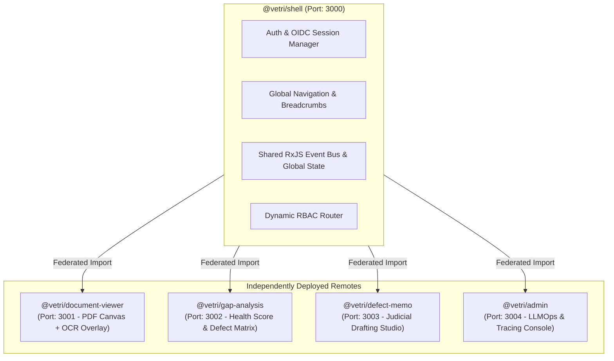
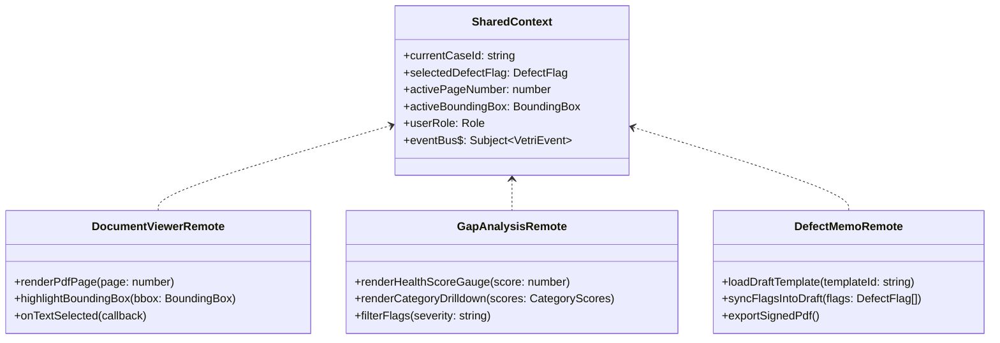

# 09 — Micro-Frontend Architecture & Presentation Platform
## Vetri (வெற்றி) — Police Cases Report Agent

---

## 1. Webpack 5 Module Federation Topology

Vetri's frontend is architected as an enterprise Micro-Frontend (MFE) system utilizing **Webpack 5 Module Federation**. This allows specialized judicial and administrative modules to be built, deployed, and scaled independently across distinct engineering squads.



---

## 2. Remote Module Specifications & Contracts



### Module Descriptions:
1. **DocumentViewer Remote (`@vetri/document-viewer`)**:
   - High-performance canvas PDF renderer built on `pdfjs-dist`.
   - SVG overlay rendering interactive bounding boxes corresponding to extracted entities.
   - Dual-page side-by-side comparison mode (e.g., FIR on Left vs. Mahazar on Right) with cross-document highlight linking.
2. **GapAnalysis Remote (`@vetri/gap-analysis`)**:
   - Radial Case Health Score gauge (0–100) with color-coded risk bands (Red: $<60$, Amber: $60-84$, Green: $\ge 85$).
   - Interactive Defect Flag Matrix categorized by Severity (Critical, Major, Minor, Info).
   - Selecting any flag automatically broadcasts an event to `DocumentViewer` to navigate directly to the offending page and highlight the relevant text slice.
3. **DefectMemo Remote (`@vetri/defect-memo`)**:
   - Markdown/Rich-Text editor pre-hydrated with High Court Defect Notice templates.
   - Clause-by-clause editing with instant statutory rule citations.
   - Export to PDF and DSC (Digital Signature Certificate) integration via e-Sign gateway.
4. **Admin Remote (`@vetri/admin`)**:
   - Real-time LLMOps metrics: token consumption per case, VLM latency, and LangSmith execution traces.

---

## 3. Cross-Remote Event Bus Protocol (RxJS)

Communication across micro-frontends is decoupled using a shared RxJS event stream:

```typescript
// Shared Event Types across Remotes
export type VetriEventType = 
  | { type: 'FLAG_SELECTED'; payload: { flagId: string; pageNumber: number; bbox: BoundingBox } }
  | { type: 'PAGE_NAVIGATED'; payload: { pageNumber: number } }
  | { type: 'HEALTH_SCORE_UPDATED'; payload: { overallScore: number } }
  | { type: 'DEFECT_MEMO_MODIFIED'; payload: { memoContent: string } };

export const eventBus$ = new Subject<VetriEventType>();

// Example: GapAnalysis dispatches click -> DocumentViewer responds
export function selectFlag(flag: DefectFlag) {
  eventBus$.next({
    type: 'FLAG_SELECTED',
    payload: {
      flagId: flag.flag_id,
      pageNumber: flag.citations[0]?.page_number || 1,
      bbox: flag.citations[0]?.bounding_box
    }
  });
}
```

---

## 4. Accessibility & Government UI Guidelines (WCAG 2.1 AA)

To satisfy National Informatics Centre (NIC) and e-Courts accessibility mandates:
- **Bilingual Interface**: Seamless one-click toggling between Tamil (தமிழ்) and English.
- **High Contrast Mode**: Native support for 7:1 contrast ratio for courtroom ambient conditions.
- **Screen Reader Support**: Full ARIA labels (`aria-expanded`, `aria-live="polite"` for AI analysis alerts) and keyboard navigation (`Tab`, `Esc`, `Arrow keys`).
- **Device Responsiveness**: Adaptive layouts supporting judicial laptop screens, desktop CRT monitors at court clerk desks, and police tablets.
