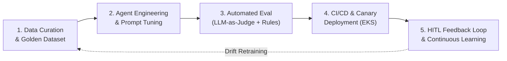
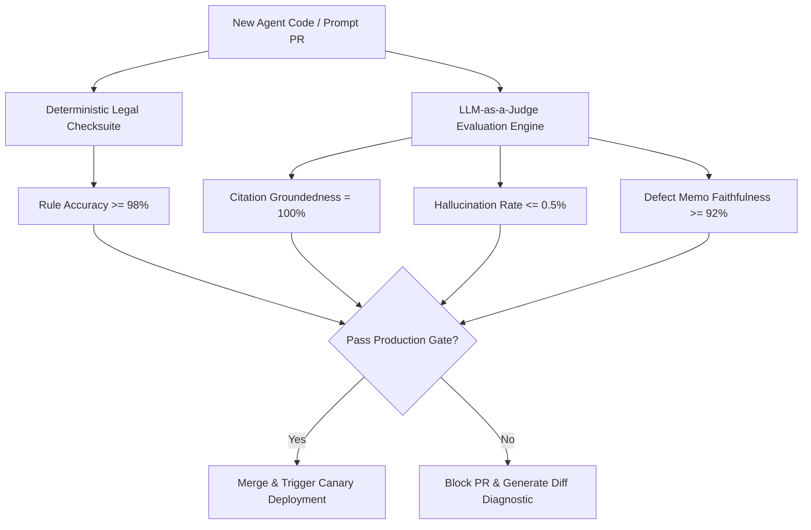

# 10 — AI Software Development Lifecycle (SDLC) & LLMOps Pipeline
## Vetri (வெற்றி) — Police Cases Report Agent

---

## 1. 5-Stage AI SDLC Lifecycle



---

## 2. Stage Breakdown & Engineering Protocols

### Stage 1: Data Curation & Golden Dataset
- **Golden Dataset**: 500 ground-truth case bundles (25,000+ total pages) verified by senior advocates and retired police superintendents.
- **Stratified Distribution**:
  - $35\%$ Property offenses (Theft, Burglary, Robbery under BNS 303–310).
  - $30\%$ Bodily injury & assault (BNS 115, 117, 103).
  - $20\%$ Special statutes (POCSO Act, NDPS Act, SC/ST POA Act).
  - $15\%$ Complex circumstantial cases with intentional evidentiary contradictions.
- **Annotation Schema**: Page layout bounding boxes, entity spans, statutory defect labels, and Ground Truth Defect Memos.

---

### Stage 2: Agent Development & Prompt Versioning
- **Version Control**: Every agent system prompt is maintained as a versioned Jinja2 template managed through Git and the MLflow Prompt Registry.
- **Prompt Structure**:
  ```
  prompts/
  ├── classifier/v1.2.0.jinja2
  ├── extractor_tamil/v2.1.0.jinja2
  ├── validator_rules/v1.5.0.jinja2
  ├── reasoner_contradictions/v2.0.0.jinja2
  └── defect_memo_draft/v1.1.0.jinja2
  ```

---

### Stage 3: Automated Evaluation (LLM-as-a-Judge + Deterministic Gates)



#### Evaluation Metrics & Hard Thresholds:
| Evaluation Metric | Evaluation Method | Hard Production Gate Threshold |
|---|---|---|
| **Document Classification Accuracy** | Categorical Precision/Recall | $\ge 96.0\%$ |
| **OCR Tamil Character Accuracy** | Levenshtein Distance / CER | $\le 8.0\%$ CER |
| **Statutory Rule Compliance Recall** | Deterministic Ground Truth Matching | $\ge 92.0\%$ |
| **Evidentiary Contradiction Precision** | LLM-as-Judge + Human Agreement | $\ge 88.0\%$ |
| **Legal Citation Groundedness** | 100% Citation Source Verification | **100.0%** (Zero Tolerance for Hallucinations) |
| **End-to-End Pipeline Latency** | 95th Percentile (50-page bundle) | $\le 90$ seconds |

---

### Stage 4: CI/CD & Canary Release Strategy

```mermaid
flowchart TD
    Git[GitHub Actions Pipeline] --> Lint[Lint & Typecheck (ruff, mypy, tsc)]
    Lint --> Unit[Pytest & Jest Unit Tests]
    Unit --> Eval[Golden Dataset Regression Suite]
    Eval --> Build[Docker Multi-Stage Container Build]
    Build --> ECR[Push to Amazon ECR India]
    ECR --> ArgoCD[ArgoCD Canary Rollout (10% Traffic)]
    ArgoCD --> Monitor{Analyze Canary Error Rate & Latency}
    Monitor -- Healthy --> FullRollout[Promote to 100% Production]
    Monitor -- Anomaly Detected --> Rollback[Instant Automated Rollback]
```

---

### Stage 5: Continuous HITL Feedback Loop & Active Learning
- **Clerk & Judge Corrections**: Whenever a court clerk modifies an OCR field or a Magistrate adds an unflagged defect, an anonymized diff event is logged.
- **Weekly Triage Review**: Machine Learning engineers review false-positive and false-negative clusters.
- **Monthly Model Fine-Tuning**: Edge cases are packaged into active learning splits to iteratively update the VLM OCR adapter and RAG reranker weights.
