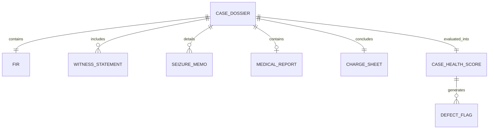

# 11 — Data Schemas & API Data Contracts
## Vetri (வெற்றி) — Police Cases Report Agent

---

## 1. Core Domain Entity Schemas



---

## 2. Pydantic v2 Production Schemas

### 2.1 FIR Schema (Sec 173 BNSS)
```python
from pydantic import BaseModel, Field
from typing import List, Optional
from datetime import datetime

class FIRSchema(BaseModel):
    fir_number: str = Field(description="e.g. 456/2026")
    police_station: str = Field(description="e.g. T. Nagar PS, Chennai")
    district: str = Field(description="e.g. Chennai City")
    date_time_of_occurrence: datetime
    date_time_of_fir_registration: datetime
    date_time_dispatched_to_magistrate: Optional[datetime] = None
    complainant_name: str
    complainant_contact: Optional[str] = None
    place_of_occurrence: str
    distance_from_ps: Optional[str] = None
    sections_invoked: List[str] = Field(description="e.g. ['303(2) BNS', '115(2) BNS']")
    brief_facts: str
    is_signed_by_complainant: bool
```

---

### 2.2 Charge Sheet / Final Report Schema (Sec 193 BNSS)
```python
from pydantic import BaseModel, Field
from typing import List, Optional
from datetime import date

class AccusedProfile(BaseModel):
    accused_id: str
    name: str
    alias: Optional[str] = None
    father_name: str
    age: int
    gender: str
    address: str
    arrest_date: Optional[date] = None
    custody_status: str = Field(description="in_custody | bail_granted | absconding | not_arrested")
    prior_convictions_count: int = 0

class OffenseCharge(BaseModel):
    section: str
    act: str = Field(description="BNS | IPC | POCSO | NDPS")
    overt_act_summary: str

class ChargeSheetSchema(BaseModel):
    charge_sheet_number: str
    case_id: str = Field(pattern=r"^TN/[A-Z]{2}/\d{4}/\d+$")
    court_name: str
    fir_reference: FIRSchema
    accused_list: List[AccusedProfile]
    offenses_charged: List[OffenseCharge]
    investigating_officer: dict
    submission_date: date
    limitation_period_valid: bool
    delay_explanation_attached: bool
```

---

### 2.3 Case Health Score & Defect Flag Schema
```python
from pydantic import BaseModel, Field
from typing import List, Optional, Literal
from datetime import datetime

class BBox(BaseModel):
    page: int
    ymin: float
    xmin: float
    ymax: float
    xmax: float

class CitationItem(BaseModel):
    document_type: str
    page_number: int
    bounding_box: Optional[BBox] = None
    extracted_snippet: str
    legal_section: Optional[str] = None

class DefectFlagSchema(BaseModel):
    flag_id: str
    severity: Literal["critical", "major", "minor", "info"]
    category: Literal[
        "missing_mandatory_doc",
        "statutory_delay",
        "timeline_contradiction",
        "evidentiary_mismatch",
        "signature_missing",
        "electronic_cert_missing"
    ]
    title: str
    description: str
    legal_reference: str
    citations: List[CitationItem]
    remediation_guidance: str

class CategoryScoresSchema(BaseModel):
    document_completeness: float = Field(ge=0.0, le=100.0)
    procedural_compliance: float = Field(ge=0.0, le=100.0)
    evidentiary_consistency: float = Field(ge=0.0, le=100.0)
    timeline_coherence: float = Field(ge=0.0, le=100.0)

class CaseHealthScoreResponse(BaseModel):
    case_id: str
    overall_health_score: float = Field(ge=0.0, le=100.0)
    category_scores: CategoryScoresSchema
    flags: List[DefectFlagSchema]
    generated_at: datetime
    system_version: str
```

---

## 3. Example Production JSON Payload

```json
{
  "case_id": "TN/CH/2026/001234",
  "overall_health_score": 68.5,
  "category_scores": {
    "document_completeness": 75.0,
    "procedural_compliance": 60.0,
    "evidentiary_consistency": 70.0,
    "timeline_coherence": 69.0
  },
  "flags": [
    {
      "flag_id": "FLG-BNSS-183-001",
      "severity": "critical",
      "category": "missing_mandatory_doc",
      "title": "Missing Sec 183 BNSS Magistrate Confession Statement",
      "description": "Charge Sheet invokes Section 64 BNS (Rape/Sexual Offense), but no statement recorded by a Judicial Magistrate under Sec 183 BNSS is attached to the bundle.",
      "legal_reference": "Sec 183(6) BNSS 2023 & Madras High Court Criminal Rules of Practice Rule 25",
      "citations": [
        {
          "document_type": "ChargeSheet_Sec193_BNSS",
          "page_number": 4,
          "bounding_box": {"page": 4, "ymin": 0.42, "xmin": 0.15, "ymax": 0.48, "xmax": 0.85},
          "extracted_snippet": "குற்றப்பிரிவு: BNS Sec 64(1)",
          "legal_section": "Sec 183(6) BNSS"
        }
      ],
      "remediation_guidance": "Forward case records to Jurisdictional Judicial Magistrate for recording victim statement under Sec 183 BNSS before filing final report."
    },
    {
      "flag_id": "FLG-TIMELINE-002",
      "severity": "major",
      "category": "timeline_contradiction",
      "title": "FIR Occurrence Time Pre-dates Scene Mahazar Inspection Time Conflict",
      "description": "FIR records incident occurrence at 22:30 hrs on 15-Aug-2026, whereas the Scene Mahazar states inspection commenced at 20:00 hrs on 15-Aug-2026.",
      "legal_reference": "Sec 105 BNSS & Tamil Nadu Police Manual Order No. 562",
      "citations": [
        {
          "document_type": "FIR_Sec173_BNSS",
          "page_number": 1,
          "bounding_box": {"page": 1, "ymin": 0.22, "xmin": 0.18, "ymax": 0.26, "xmax": 0.65},
          "extracted_snippet": "Date & Time of Occurrence: 15/08/2026 at 22:30 hours"
        },
        {
          "document_type": "SceneMahazar_Sec105_BNSS",
          "page_number": 3,
          "bounding_box": {"page": 3, "ymin": 0.18, "xmin": 0.12, "ymax": 0.22, "xmax": 0.72},
          "extracted_snippet": "சம்பவ இடப் பார்வை நேரம்: 15/08/2026 மாலை 20:00 மணி"
        }
      ],
      "remediation_guidance": "IO must furnish a clarification memo explaining the 2.5-hour chronological discrepancy."
    }
  ],
  "generated_at": "2026-09-26T00:50:00Z",
  "system_version": "v1.0.0-rc1"
}
```
