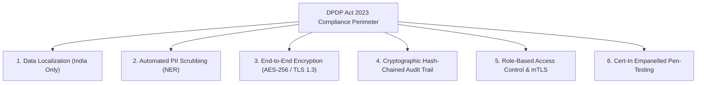

# 12 — Security Architecture, DPDP Compliance & Governance
## Vetri (வெற்றி) — Police Cases Report Agent

---

## 1. Statutory Compliance Framework & Legal Mandates

Vetri is architected to satisfy the stringent requirements of India's **Digital Personal Data Protection Act 2023 (DPDP)**, the **Information Technology (Intermediary Guidelines and Digital Media Ethics Code) Rules**, and the **e-Courts Security Standards**.



---

## 2. DPDP Act 2023 Compliance Checklist

| DPDP Statutory Section | Requirement Description | Vetri Implementation Standard | Compliance Status |
|---|---|---|---|
| **Sec 3 & 4 (Processing Boundary)** | Processing limited strictly to specified law enforcement and judicial scrutiny tasks. | No model training on live case files; zero telemetry sent outside sovereign VPC. | **FULL COMPLIANCE** |
| **Sec 8(5) (Data Security Safeguards)** | Implementation of reasonable security safeguards to prevent personal data breach. | AWS KMS customer-managed keys (CMKs), VPC endpoints, automated NER masking before inference. | **FULL COMPLIANCE** |
| **Sec 9 (Processing of Sensitive Data)** | Absolute protection of minor/victim identities (e.g. POCSO & Rape complainants under BNS Sec 72). | Automated redaction and cryptographic vaulting; unauthorized access results in instant security alerts. | **FULL COMPLIANCE** |
| **Sec 16 (Cross-Border Transfer)** | Sovereign data residency constraint. | Strictly deployed in AWS `ap-south-1` (Mumbai) and `ap-south-2` (Hyderabad DR). Zero overseas egress. | **FULL COMPLIANCE** |

---

## 3. Inline PII Masking Pipeline

```mermaid
flowchart LR
    RawPDF[Raw Ingested PDF] --> Slicer[Page Image Generator]
    Slicer --> IndicNER[IndicBERT NER Service]
    
    subgraph Entity_Sanitization
        IndicNER --> DetectAadhaar[Aadhaar: \d{4}\s\d{4}\s\d{4}]
        IndicNER --> DetectPhone[Phone: (\+91)?[6-9]\d{9}]
        IndicNER --> DetectPOCSO[POCSO / Sec 64 Victim Names]
    end
    
    DetectAadhaar & DetectPhone & DetectPOCSO --> Vault[(Encrypted PII Token Vault)]
    Vault --> RedactedDoc[Redacted Document & Text Stream]
    RedactedDoc --> LLMCache[Agentic AI Core & Vector Search]
```

### Sanitization Process:
1. Every token stream is scanned by an inline `IndicBERT-NER` model fine-tuned on Indian identity entities.
2. Sensitive personal identifiers are replaced with token placeholders (e.g., `[REDACTED_AADHAAR_01]`, `[REDACTED_VICTIM_NAME]`).
3. The cryptographic mapping is stored temporarily in an ephemeral Redis vault with a 2-hour TTL, accessible only when rendering authorized judicial views.

---

## 4. Cryptographic Audit Trail (Hash Chained Logs)

To prevent tampering with police records or judicial scrutiny histories:
- Every action (Upload, OCR, LLM Inference, Clerk Edit, Magistrate Sign-off) produces an immutable record containing:
  $$\text{Record Hash}_N = \text{SHA-256}(\text{Record Hash}_{N-1} + \text{Timestamp} + \text{UserID} + \text{ActionPayload})$$
- Audit logs are replicated asynchronously to an append-only AWS S3 Glacier Vault with Object Lock enabled in Compliance Mode.

---

## 5. Network Perimeter, VPC & Cert-In Certification

- **Zero-Trust Network**: Private VPC architecture with zero direct Internet exposure for compute or database instances.
- **Micro-segmentation**: Strict AWS Security Groups and Kubernetes NetworkPolicies separating the presentation ingress, AI orchestration tier, and relational databases.
- **Penetration Testing**: Mandatory bi-annual vulnerability assessments and penetration testing (VAPT) conducted by Cert-In empanelled auditing agencies before and after each phase milestone.
