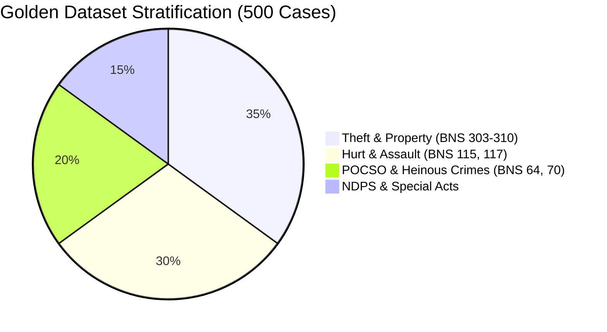
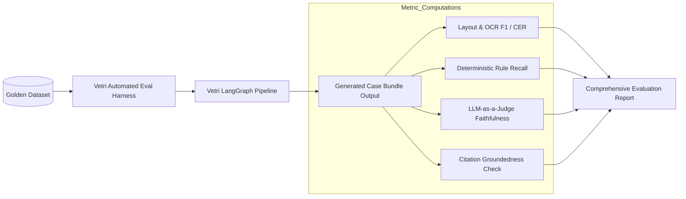

# 13 — Evaluation Framework & Quality Assurance Harness
## Vetri (வெற்றி) — Police Cases Report Agent

---

## 1. Golden Dataset Architecture & Annotation Protocol

The Vetri evaluation harness relies on a rigorously curated **500-case Golden Dataset** capturing real-world variability in Tamil Nadu police documentation.



### Multi-Layer Annotation Standard:
1. **Layer 1 (Layout & OCR Ground Truth)**: Precise bounding boxes (`[ymin, xmin, ymax, xmax]`) and verbatim Tamil/English text transcriptions for every page.
2. **Layer 2 (Entity Spans)**: Labeled timestamps, accused names, weapon descriptions, police station names, and penal sections.
3. **Layer 3 (Procedural Ground Truth)**: Verified list of statutory defects, missing mandatory annexures, and timing delays according to BNSS 2023.
4. **Layer 4 (Evidential Contradiction Truth)**: Verified list of cross-document logical contradictions with exact citing pages.
5. **Layer 5 (Golden Defect Memo)**: Formal, human-drafted Defect Return Memo signed off by retired judicial officers.

---

## 2. Automated Evaluation Harness & Metrics



### Evaluation Dimensions:
- **Character Error Rate (CER)**: $\text{CER} = \frac{S + D + I}{N}$ evaluated separately on handwritten Tamil, printed Tamil, and typed English.
- **Defect Detection Recall**: Percentage of actual procedural defects correctly surfaced by the Validator Agent.
- **Contradiction Precision**: Percentage of flagged contradictions that represent genuine evidential conflicts (reducing false judicial alarms).
- **Citation Groundedness**: Strict binary check ensuring every legal reference and document quote exists in the source files.

---

## 3. LLM-as-a-Judge Evaluation Prompts

```python
EVAL_SYSTEM_PROMPT = """
You are a Senior Judicial Scrutiny Auditor evaluating an AI-generated Case Health Summary and Defect Memo against the verified ground-truth legal case bundle.

Evaluate the AI output across 4 strict dimensions:
1. FAITHFULNESS (1-5): Does the Defect Memo accurately reflect only facts present in the police documents? (Any hallucinated fact gives a score of 1).
2. LEGAL ACCURACY (1-5): Are all cited BNSS/BSA/BNS sections strictly applicable and correctly formulated?
3. CITATION GROUNDEDNESS (1-5): Does every flag cite the correct page number and document type?
4. CLARITY & LEGAL TONE (1-5): Does the drafting conform to Madras High Court Criminal Rules of Practice?

Output your evaluation strictly in JSON format:
{
  "faithfulness_score": float,
  "legal_accuracy_score": float,
  "citation_groundedness_score": float,
  "tone_score": float,
  "identified_hallucinations": list[str],
  "reasoning": str
}
"""
```

---

## 4. Production Release Gates & Regression Matrix

| Milestone Gate | Required OCR CER | Minimum Defect Recall | Minimum Contradiction Precision | Max Hallucination Rate |
|---|---|---|---|---|
| **Alpha Gate (End of Phase 1)** | $\le 12.0\%$ | $\ge 75.0\%$ | $\ge 70.0\%$ | $\le 3.0\%$ |
| **Beta Gate (End of Phase 2)** | $\le 8.0\%$ | $\ge 88.0\%$ | $\ge 85.0\%$ | $\le 0.5\%$ |
| **Production Gate (End of Phase 3)** | $\le 6.0\%$ | $\ge 94.0\%$ | $\ge 90.0\%$ | **0.0% (Zero Tolerance)** |
