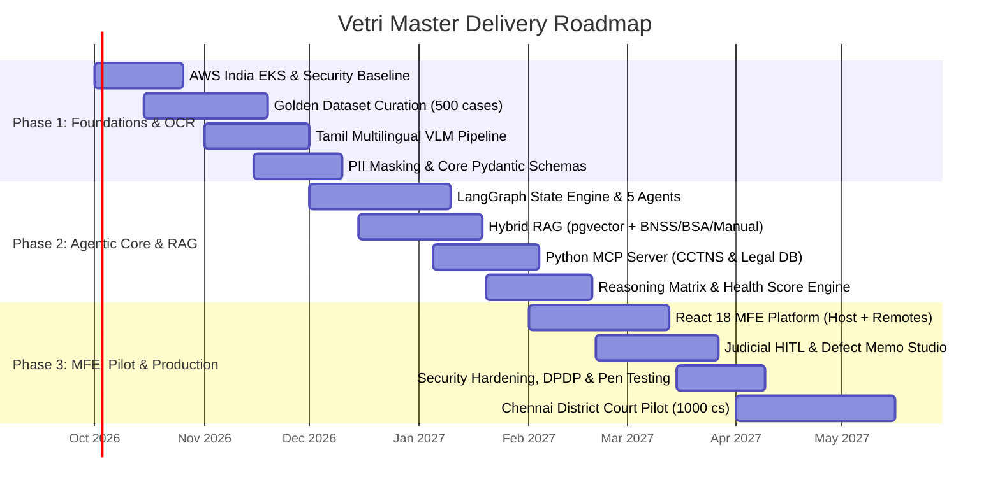
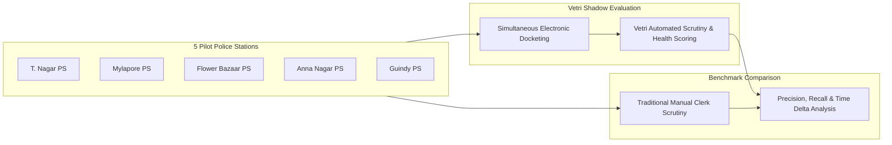

# 14 — Phased Implementation Roadmap & Milestone Schedule
## Vetri (வெற்றி) — Police Cases Report Agent

---

## 1. 3-Phase Master Strategic Schedule

---

## 2. Granular Phase Workstreams & Deliverables

### 🚀 PHASE 1: Data Foundations, Bilingual VLM Pipeline & Ingestion
- **Timeframe**: October 1 – November 30, 2026 (9 Weeks)
- **Primary Objective**: Establish secure India-cloud infrastructure, curate the 500-case Golden Dataset, and engineer the Tamil/English multimodal OCR pipeline.
- **Key Deliverables**:
  - `EKS-KMS-VPC`: Fully configured AWS India (`ap-south-1`) Kubernetes infrastructure with GPU node groups.
  - `Golden-500`: Dual-annotated dataset of 500 ground-truth case files.
  - `VLM-Tamil-Engine`: `Qwen2.5-VL` OCR service with bounding-box extraction.
  - `PII-Redactor`: `IndicBERT-NER` inline personal data scrubber.
- **Ownership**: AI/ML Lead (3 engineers), Legal Annotators (5), Cloud Architect (1).

---

### ⚡ PHASE 2: Agentic Multi-Agent Core, Hybrid RAG & MCP Integration
- **Timeframe**: December 1, 2026 – January 31, 2027 (9 Weeks)
- **Primary Objective**: Build the 5-agent LangGraph workflow, construct the statutory RAG knowledge base, and integrate external ecosystem tools via MCP.
- **Key Deliverables**:
  - `LangGraph-StateGraph`: Resilient cyclical state machine orchestrating Classifier, Extractor, Validator, Reasoner, and Defect Memo agents.
  - `Hybrid-RAG-DB`: `pgvector` store indexed with BNSS 2023, BSA 2023, BNS 2023, and TN Police Manual.
  - `MCP-Server-Vetri`: Standardized JSON-RPC 2.0 tool server connecting CCTNS, High Court precedents, and RFSL lab APIs.
  - `HealthScore-Core`: Mathematical scoring algorithm and contradiction matrix.
- **Ownership**: Lead Agent Engineer (3), Backend Engineers (2), Legal SME (2).

---

### 🛡️ PHASE 3: Micro-Frontend UI, Judicial HITL Workflows, CCTNS & Pilot
- **Timeframe**: February 1 – April 30, 2027 (12 Weeks)
- **Primary Objective**: Deliver the React 18 Module Federation frontend, implement human-in-the-loop judicial workflows, achieve Cert-In security certification, and execute a 1,000-case shadow pilot in Chennai District Courts.
- **Key Deliverables**:
  - `MFE-Platform`: Webpack 5 Host Shell + 4 Remotes (`DocumentViewer`, `GapAnalysis`, `DefectMemo`, `AdminConsole`).
  - `HITL-Studio`: Clerk triage view and Judicial Magistrate Defect Memo drafting workspace.
  - `Cert-In-VAPT`: Third-party penetration testing and DPDP Act 2023 compliance audit sign-off.
  - `Pilot-Execution`: Shadow deployment across 5 Chennai police stations and 2 Magistrate Courts.
- **Ownership**: Lead Frontend Architect (4), Delivery Manager, SRE Lead, Judicial Liaisons.

---

## 3. Chennai District Court Shadow Pilot Plan

### Pilot Success Gate Criteria:
1. $\ge 90\%$ Precision and $\ge 85\%$ Recall on procedural defect detection across 1,000 live cases.
2. Reduction of court clerk docketing time from 40 minutes to under 8 minutes per case.
3. Over $75\%$ voluntary adoption rate among pilot judicial officers and bench readers.
