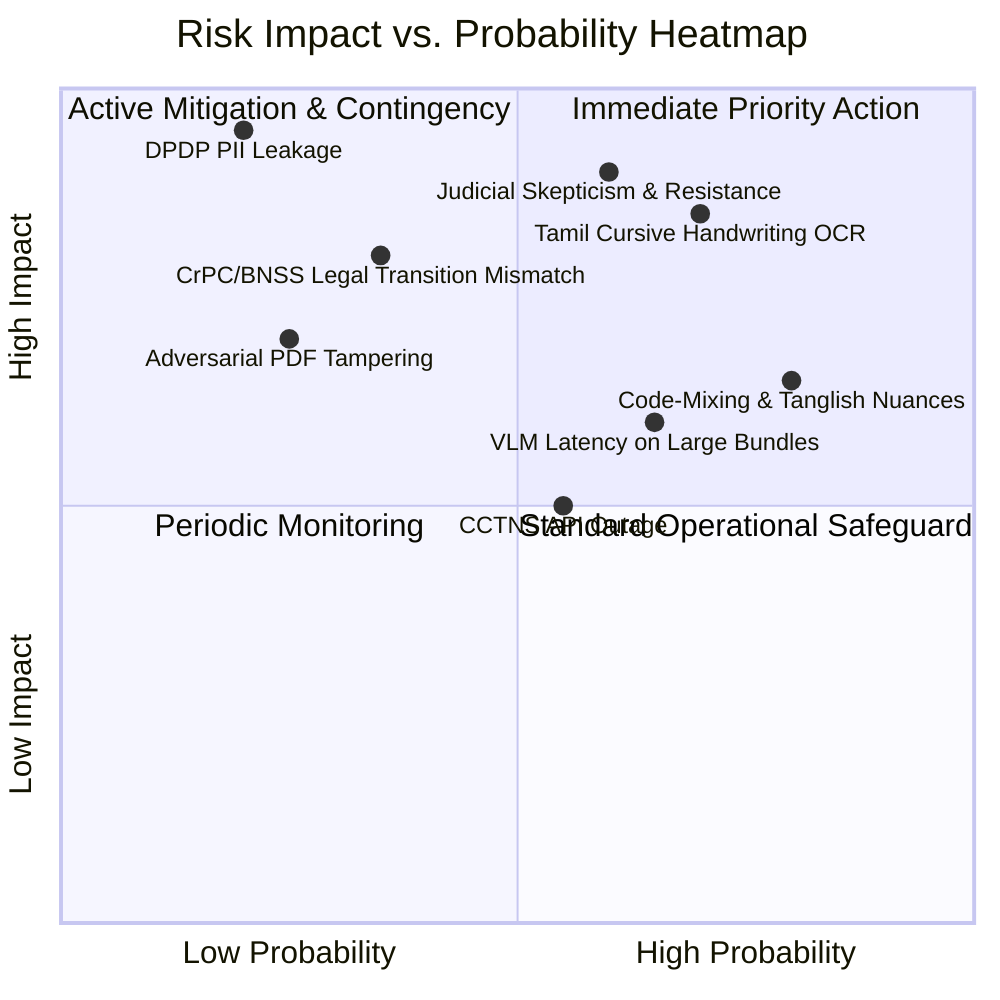

# 15 — Risk Management Matrix & Mitigation Protocols
## Vetri (வெற்றி) — Police Cases Report Agent

---

## 1. Enterprise Risk Matrix & Impact Heatmap

---

## 2. Comprehensive Risk Register

| Risk ID | Risk Category & Description | Prob. | Impact | Mitigation Strategy | Contingency Plan | Owner |
|---|---|---|---|---|---|---|
| **RSK-01** | **Tamil Cursive Handwriting Failure**: Faded ink, regional script variations, or low-resolution scans cause OCR errors. | High | High | Dual-engine OCR architecture (`Qwen2.5-VL` + fine-tuned `TrOCR-Tamil`) with adaptive image contrast preprocessing (CLAHE). | Automated confidence scoring flags ambiguous tokens to Clerk Triage Queue. | Lead AI Engineer |
| **RSK-02** | **Judicial Skepticism & Distrust**: Judicial Officers reject AI recommendations fearing non-transparent automation. | Med | High | "AI as Assistant" model. Strict citation transparency: every assertion shows the exact PDF bounding box. Zero automated court orders. | Hands-on orientation at the Tamil Nadu State Judicial Academy (TNSJA). | Product Lead / Legal SME |
| **RSK-03** | **Tanglish & Legal Slang Misinterpretation**: Colloquial police expressions misinterpreted by general LLMs. | High | Med | Ingest Madras High Court criminal glossaries and 500-case Golden Dataset with Tamil police idioms into RAG. | Rule-based fallback dictionary for regional slang. | NLP Specialist |
| **RSK-04** | **DPDP Act & PII Privacy Violation**: Accused or POCSO victim details leaked in LLM prompts or logs. | Low | Critical | Inline `IndicBERT-NER` scrubber redacts Aadhaar, phone, and victim identities before embedding. India-only VPC hosting. | Instant SOC alert + automatic session revocation. | Security Architect |
| **RSK-05** | **Legacy CrPC $\leftrightarrow$ BNSS Transition Errors**: Offenses committed prior to July 1, 2024 evaluated under modern BNSS rules. | Med | High | Dual-engine legal parser. Ingestion date-of-offense classifier automatically selects appropriate statutory schema. | Manual statutory override toggle in UI. | Legal Advisor |
| **RSK-06** | **CCTNS / ICJS Network Downtime**: Police database unavailable during automated triage. | Med | Med | Circuit breaker pattern on MCP server with asynchronous background polling. | Scrutiny proceeds with note: *"CCTNS verification pending"*. | Backend Lead |
| **RSK-07** | **Large Bundle Inference Latency**: 300-page case files taking $> 5$ minutes to process. | High | Med | Async parallel page slicing with worker pools on GPU EKS node groups; progressive UI streaming. | Background job processing with WebSocket notification. | SRE Lead |
| **RSK-08** | **Prompt Injection / Adversarial PDFs**: Malicious text hidden in police dossiers attempting to hijack agent behavior. | Low | High | Strip non-printable characters, execute strict markdown sanitization, and use system prompt delimiter isolation. | Quarantine bundle for security inspection. | Security Lead |
