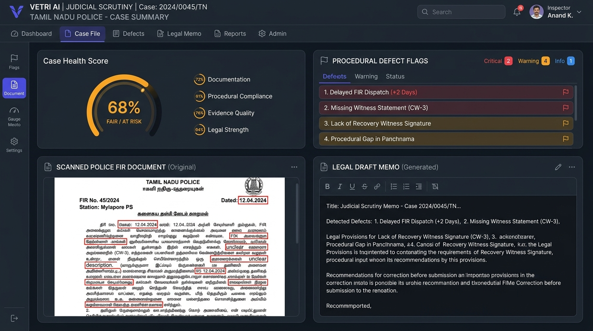
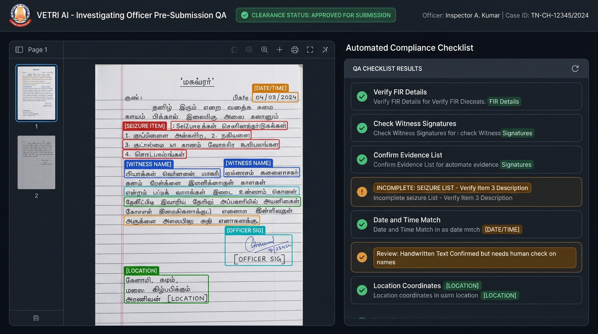
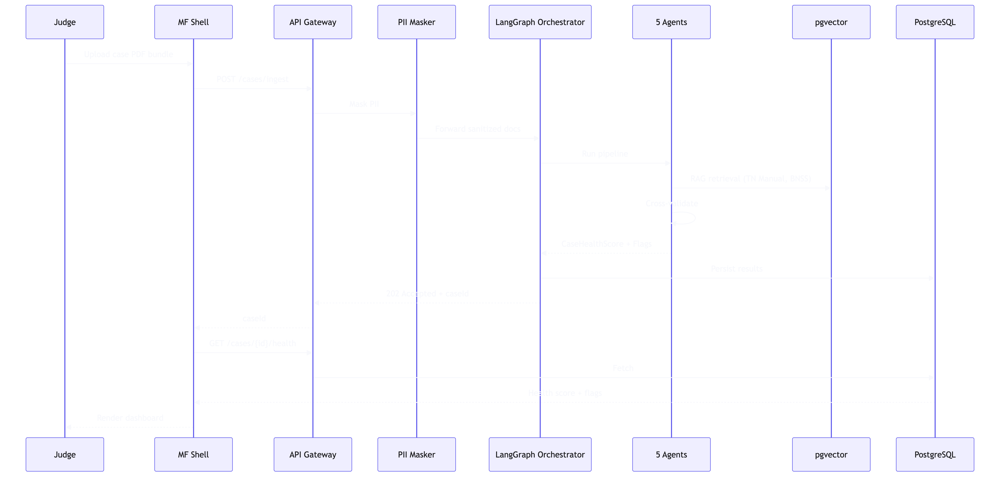

# Vetri UI & Architecture Screenshots

This directory contains visual screenshots, user interface designs, and system architecture diagrams for **Vetri (வெற்றி) — Police Cases Report Agent**.

---

## 1. Judicial Scrutiny Dashboard

*High-contrast Judicial Scrutiny Bench experience showing radial Case Health Score (68%), categorized procedural defect flags, side-by-side scanned document with red bounding-box annotations, and auto-generated Rule 34 Defect Return Notice.*

---

## 2. Investigating Officer Pre-Submission QA & Tamil OCR

*Self-service Pre-Submission QA for Investigating Officers showing handwritten Tamil Mahazar layout analysis with bounding boxes (`[DATE/TIME]`, `[SEIZURE ITEM]`, `[WITNESS NAME]`, `[OFFICER SIG]`) alongside the automated compliance checklist.*

---

## 3. End-to-End System Architecture Flow

*5-Tier enterprise architecture diagram spanning React Module Federation, Security & PII Redaction, LangGraph 5-agent state machine, pgvector RAG, and state CCTNS/ICJS integration.*
