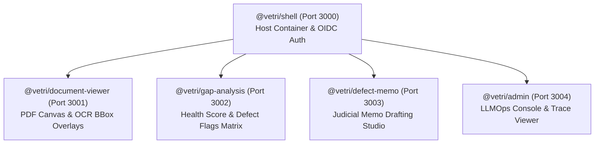

# Frontend Platform & Micro-Frontend Architecture (`frontend/`)
## Vetri (வெற்றி) — Police Cases Report Agent

---

## 1. Frontend Architecture Overview

The `frontend/` module defines the enterprise Webpack 5 Module Federation platform powering **Vetri (வெற்றி)**. The application is built using **React 18**, **TypeScript**, **RxJS**, and **Tailwind CSS**.

---

## 2. Directory Structure & Documentation

| Document | Primary Focus | Key Deliverables |
|---|---|---|
| **[micro-frontend-modules.md](file:///Users/apple/projects/tnpolice-case-summary-agent/frontend/micro-frontend-modules.md)** | Module Federation Configuration | Webpack config, shared dependencies, RxJS event bus |
| **[judge-dashboard.md](file:///Users/apple/projects/tnpolice-case-summary-agent/frontend/judge-dashboard.md)** | Judicial Scrutiny Bench Experience | Case health score gauge, contradiction explorer, e-Sign |
| **[clerk-triage-view.md](file:///Users/apple/projects/tnpolice-case-summary-agent/frontend/clerk-triage-view.md)** | Court Registry Filing Workflow | Rapid OCR correction, document indexing, CIS export |
| **[io-pre-submission-qa.md](file:///Users/apple/projects/tnpolice-case-summary-agent/frontend/io-pre-submission-qa.md)** | Police Station Pre-Filing QA | Self-service upload, pre-submission checklist, readiness cert |

---

## 3. Technology Stack & Packages

- **Core**: React 18.3+, TypeScript 5.5+, React Router 6.27+
- **Micro-Frontend**: Webpack 5.95+ Module Federation Plugin
- **State Management**: RxJS 7.8+ (Cross-Remote Event Streaming) + React Context
- **PDF Rendering**: `pdfjs-dist` with custom HTML5 Canvas & SVG coordinate layers
- **Styling**: Tailwind CSS with custom High-Contrast Judicial themes
- **Accessibility**: WCAG 2.1 AA certified with Tamil (தமிழ்) localization
