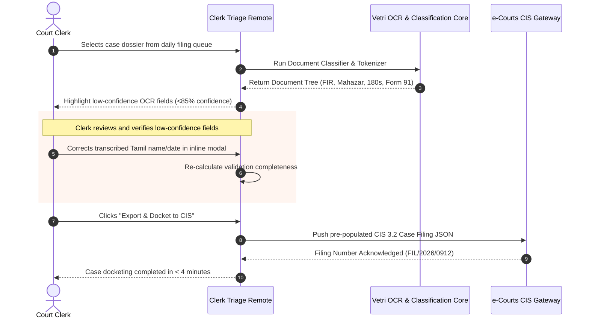

# Frontend View: Court Clerk Automated Filing & Triage
## Vetri (வெற்றி) — Police Cases Report Agent

---

## 1. Registry Scrutiny & Docketing Workflow

The **Clerk Triage View** is designed for Court Registry Staff, Bench Readers, and Chief Ministerial Officers (CMOs) receiving newly submitted police dossiers at the court filing counter.

---

## 2. Key Screen Components

1. **Document Tree & Page Indexer**: Visual thumbnail strip showing page numbers, detected document types, and thumbnail flags for missing signature blocks.
2. **Low-Confidence OCR Correction Modal**: Floating zoom-in lens displaying the raw scanned pixel crop alongside the editable transcription input.
3. **CIS 3.2 Schema Mapper**: Automated mapping of extracted police data into court registry filing fields (Complainant, Accused, Offense Sections, Remand Dates, Seized Property Serial Numbers).
