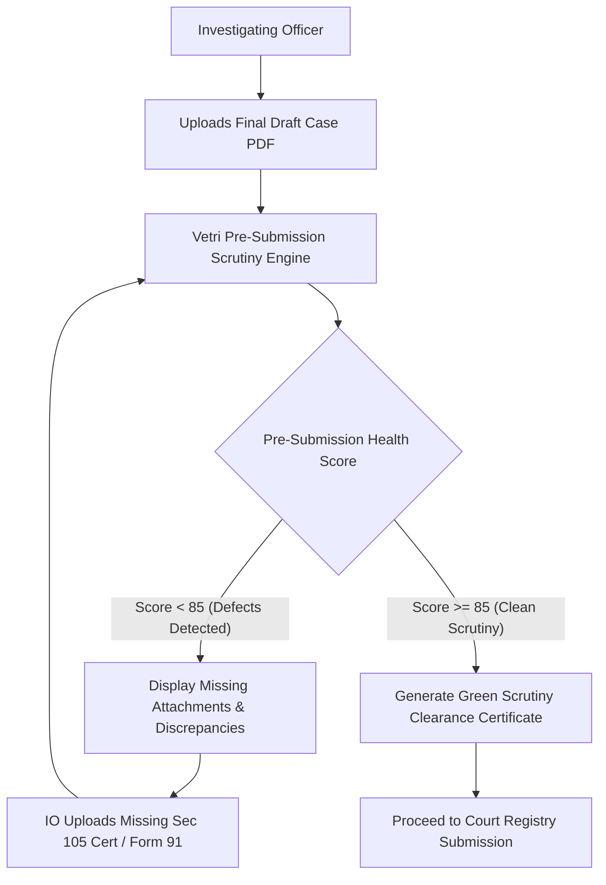

# Frontend View: Investigating Officer Pre-Submission QA
## Vetri (வெற்றி) — Police Cases Report Agent

---

## 1. Police Station Pre-Submission Workflow

The **Investigating Officer (IO) Pre-Submission QA View** provides Sub-Inspectors and Inspectors of Police with a self-service pre-audit tool to inspect digital case files before submitting physical or electronic bundles to the court registry.

---

## 2. Interactive Pre-Submission Checklist

The UI renders an intuitive, color-coded checklist aligned with Chapter XII of the Tamil Nadu Police Manual:

| Mandatory Requirement | Status Indicator | Action Required if Deficient |
|---|---|---|
| **FIR Dispatch within 24 Hours (Sec 176 BNSS)** | 🟢 Verified | None |
| **Scene Mahazar with 2 Local Witnesses** | 🟢 Verified | None |
| **Mandatory Audio-Video Sec 105 BNSS Hash** | 🔴 Missing | Attach Videography Certificate signed by IO |
| **Sec 183 BNSS Statement (POCSO/Sec 64 BNS)** | 🔴 Missing | Forward file to Judicial Magistrate for recording statement |
| **Form 91 Property Deposit Acknowledgment** | 🟡 Pending | Attach Court Property Room Initial Seal |
| **Chemical Analysis / RFSL Requisition Form** | 🟢 Verified | None |

---

## 3. Green Scrutiny Clearance Certificate

When all mandatory procedural requirements pass, the system generates a tamper-evident **Pre-Submission Clearance Slip** bearing a QR code that court clerks can scan at the filing counter to instantly verify that the bundle passed preliminary algorithmic validation.
