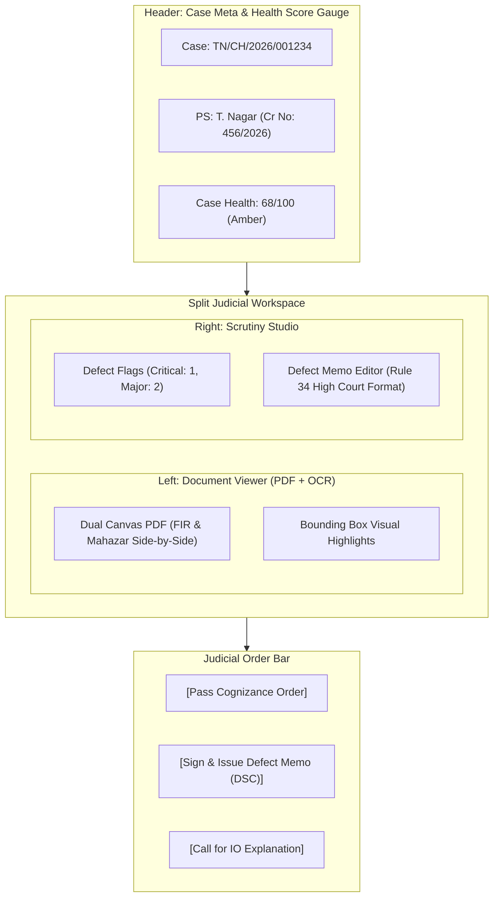

# Frontend View: Judicial Magistrate Dashboard
## Vetri (வெற்றி) — Police Cases Report Agent

---

## 1. Judicial Dashboard Layout & User Experience

The **Judge Dashboard** provides an optimized, high-density interface for Judicial Magistrates and District Judges during cognizance and charge sheet scrutiny hearings.

---

## 2. Core Interactive Features

### 2.1 Interactive Citation Jumping
- Clicking on any flag in the **Defect Flags List** triggers an event:
  - Instantly loads the cited PDF page in the left viewer pane.
  - Automatically scrolls the view to center the offending text.
  - Renders a pulsing red/amber SVG bounding box around the exact sentence or missing signature area.

### 2.2 Side-by-Side Contradiction Comparison
- When reviewing a contradiction (e.g. Incident Time vs. Mahazar Time):
  - Left pane displays Page 1 of the FIR with the occurrence time highlighted.
  - Right sub-pane displays Page 3 of the Scene Mahazar with the inspection start time highlighted.

### 2.3 One-Click Judicial Defect Memo Generation
- Clicking **[Generate Defect Return Memo]** creates a pre-populated draft following Madras High Court Criminal Rules of Practice.
- Allows the Magistrate to add free-text judicial remarks.
- Generates a PDF/A document and invokes the state judicial USB Token / e-Sign gateway for digital signing.
