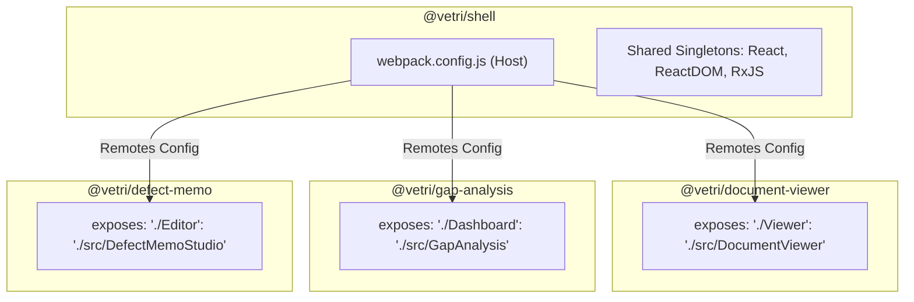

# Micro-Frontend Configuration & Module Federation Setup
## Vetri (வெற்றி) — Police Cases Report Agent

---

## 1. Webpack 5 Module Federation Architecture



---

## 2. Host Shell Webpack Configuration (`shell/webpack.config.js`)

```javascript
const HtmlWebpackPlugin = require('html-webpack-plugin');
const { ModuleFederationPlugin } = require('webpack').container;
const deps = require('./package.json').dependencies;

module.exports = {
  mode: 'development',
  devServer: {
    port: 3000,
    historyApiFallback: true,
  },
  plugins: [
    new ModuleFederationPlugin({
      name: 'vetri_shell',
      remotes: {
        documentViewer: 'documentViewer@http://localhost:3001/remoteEntry.js',
        gapAnalysis: 'gapAnalysis@http://localhost:3002/remoteEntry.js',
        defectMemo: 'defectMemo@http://localhost:3003/remoteEntry.js',
        adminConsole: 'adminConsole@http://localhost:3004/remoteEntry.js',
      },
      shared: {
        react: { singleton: true, requiredVersion: deps.react },
        'react-dom': { singleton: true, requiredVersion: deps['react-dom'] },
        'react-router-dom': { singleton: true, requiredVersion: deps['react-router-dom'] },
        rxjs: { singleton: true, requiredVersion: deps.rxjs },
      },
    }),
    new HtmlWebpackPlugin({
      template: './public/index.html',
    }),
  ],
};
```

---

## 3. Remote Module Configuration (`remotes/document-viewer/webpack.config.js`)

```javascript
const { ModuleFederationPlugin } = require('webpack').container;
const deps = require('./package.json').dependencies;

module.exports = {
  mode: 'development',
  devServer: {
    port: 3001,
    headers: { 'Access-Control-Allow-Origin': '*' },
  },
  plugins: [
    new ModuleFederationPlugin({
      name: 'documentViewer',
      filename: 'remoteEntry.js',
      exposes: {
        './Viewer': './src/DocumentViewer',
      },
      shared: {
        react: { singleton: true, requiredVersion: deps.react },
        'react-dom': { singleton: true, requiredVersion: deps['react-dom'] },
        rxjs: { singleton: true, requiredVersion: deps.rxjs },
      },
    }),
  ],
};
```

---

## 4. Cross-Module State Sharing Contract

```typescript
// @vetri/shared-contracts
export interface BoundingBox {
  page: number;
  ymin: number;
  xmin: number;
  ymax: number;
  xmax: number;
}

export interface DefectFlag {
  flag_id: string;
  severity: 'critical' | 'major' | 'minor' | 'info';
  title: string;
  description: string;
  legal_reference: string;
  citations: Array<{
    document_type: string;
    page_number: number;
    bounding_box?: BoundingBox;
    extracted_snippet: string;
  }>;
}
```
