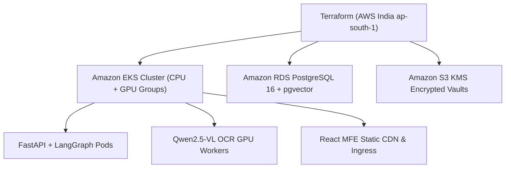

# Infrastructure, Cloud & Deployment Architecture (`infra/`)
## Vetri (வெற்றி) — Police Cases Report Agent

---

## 1. Overview

The `infra/` directory contains the Infrastructure-as-Code (Terraform), Kubernetes deployment manifests (Helm), CI/CD pipelines, and network integration designs for deploying **Vetri (வெற்றி)** in compliance with Government of India and Tamil Nadu state cloud guidelines.

---

## 2. Directory Structure & Documentation

| Document | Primary Focus | Key Deliverables |
|---|---|---|
| **[aws-deployment.md](file:///Users/apple/projects/tnpolice-case-summary-agent/infra/aws-deployment.md)** | AWS India Sovereign Infrastructure | Terraform modules, EKS topology, GPU nodes, KMS keys |
| **[llmops-pipeline.md](file:///Users/apple/projects/tnpolice-case-summary-agent/infra/llmops-pipeline.md)** | LLMOps & Observability Pipeline | LangSmith tracing, MLflow prompt registry, Grafana dashboards |
| **[cctns-integration.md](file:///Users/apple/projects/tnpolice-case-summary-agent/infra/cctns-integration.md)** | CCTNS & ICJS State Network Integration | Secure VPN tunnels, mTLS gateways, JSON-RPC MCP adapter |

---

## 3. Sovereign Cloud & Compliance Mandates
- **Data Localization**: Compute and storage strictly restricted to AWS `ap-south-1` (Mumbai) and `ap-south-2` (Hyderabad DR).
- **Govt Cloud Alignment**: Compatible with MeghRaj (National Cloud of India) and TNeGA (Tamil Nadu e-Governance Agency) private cloud infrastructure.
- **Zero Public DB Exposure**: Databases and vector instances are isolated inside private VPC subnets with AWS PrivateLink endpoints.
