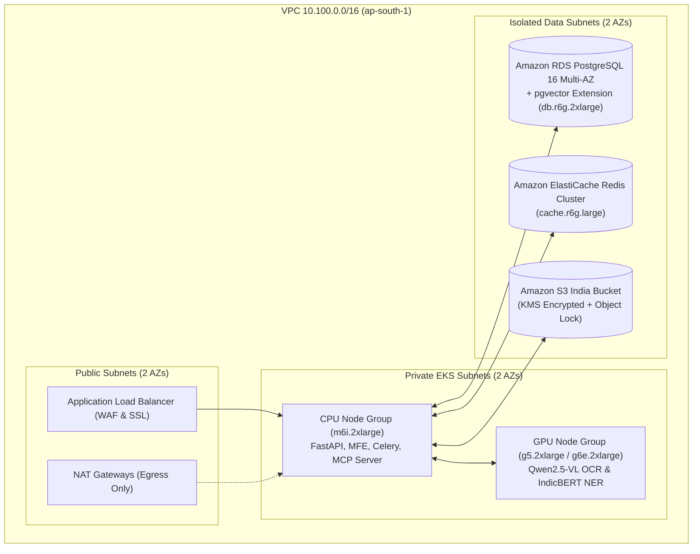

# AWS India Cloud Infrastructure & EKS Deployment Blueprint
## Vetri (வெற்றி) — Police Cases Report Agent

---

## 1. AWS India Region Topology (`ap-south-1` Mumbai)



---

## 2. Kubernetes Manifest Skeleton (`infra/k8s/vetri-backend.yaml`)

```yaml
apiVersion: apps/v1
kind: Deployment
metadata:
  name: vetri-backend
  namespace: vetri-prod
  labels:
    app: vetri-backend
spec:
  replicas: 4
  selector:
    matchLabels:
      app: vetri-backend
  template:
    metadata:
      labels:
        app: vetri-backend
    spec:
      containers:
      - name: api
        image: 123456789012.dkr.ecr.ap-south-1.amazonaws.com/vetri-backend:v1.0.0
        ports:
        - containerPort: 8000
        envFrom:
        - configMapRef:
            name: vetri-config
        - secretRef:
            name: vetri-secrets
        resources:
          requests:
            cpu: "2000m"
            memory: "4Gi"
          limits:
            cpu: "4000m"
            memory: "8Gi"
        readinessProbe:
          httpGet:
            path: /api/v1/health
            port: 8000
          initialDelaySeconds: 15
          periodSeconds: 10
---
apiVersion: apps/v1
kind: Deployment
metadata:
  name: vetri-ocr-worker
  namespace: vetri-prod
spec:
  replicas: 2
  template:
    spec:
      nodeSelector:
        node.kubernetes.io/instance-type: g5.2xlarge
      containers:
      - name: vlm-ocr
        image: 123456789012.dkr.ecr.ap-south-1.amazonaws.com/vetri-vlm-worker:v1.0.0
        resources:
          limits:
            nvidia.com/gpu: 1
```

---

## 3. Infrastructure Cost Estimation & Sizing Table (Pilot vs. State Scale)

| Component | Pilot Sizing (Chennai District) | Monthly Cost (Pilot) | State Scale Sizing (All TN Districts) | Monthly Cost (State Scale) |
|---|---|---|---|---|
| **EKS CPU Nodes** | 2x `m6i.xlarge` | ~$280 | 12x `m6i.2xlarge` | ~$3,360 |
| **EKS GPU OCR Nodes** | 2x `g5.2xlarge` (NVIDIA A10G) | ~$1,470 | 16x `g5.2xlarge` | ~$11,760 |
| **RDS PostgreSQL (pgvector)** | `db.r6g.xlarge` Multi-AZ | ~$380 | `db.r6g.4xlarge` Multi-AZ | ~$1,520 |
| **ElastiCache Redis** | `cache.r6g.large` | ~$140 | `cache.r6g.2xlarge` Cluster | ~$560 |
| **S3 Storage & KMS** | 5 TB KMS Encrypted | ~$130 | 120 TB KMS Encrypted | ~$2,880 |
| **Total Monthly Infra Cost** | — | **~$2,400 USD / mo** | — | **~$20,080 USD / mo** |
