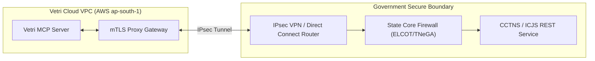

# CCTNS & Inter-operable Criminal Justice System (ICJS) Integration
## Vetri (வெற்றி) — Police Cases Report Agent

---

## 1. Network Topology & State Data Centre Integration

Vetri connects to the **Crime and Criminal Tracking Network & Systems (CCTNS)** and the **Inter-operable Criminal Justice System (ICJS)** hosted at the **Tamil Nadu State Data Centre (TNSDC / ELCOT)** via dedicated redundant IPsec VPN tunnels and AWS Direct Connect.

---

## 2. Interface Specifications & Security Protocol

### 2.1 Protocol & Authentication
- **Transport**: HTTPS over TLS 1.3 with mutual certificate-based authentication (mTLS).
- **Format**: JSON-RPC 2.0 wrapped REST endpoints.
- **Authorization**: Time-bound JWT tokens signed by the Tamil Nadu Police DGP Cyber Wing authority.

### 2.2 Endpoints Utilized:
1. `GET /cctns/api/v2/accused/antecedents`: Queries criminal history by Aadhaar hash or Name + Father's Name + District.
2. `GET /cctns/api/v2/fir/status`: Verifies FIR registration timestamp and General Diary dispatch serial.
3. `POST /cctns/api/v2/defect-memo/notify`: Asynchronously pushes approved judicial defect return notices directly to the Station House Officer (SHO) portal.
