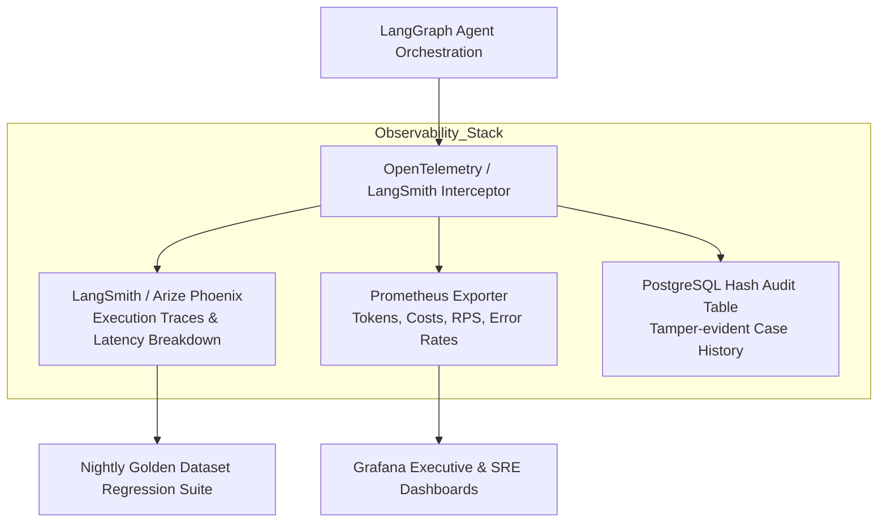

# LLMOps Pipeline, Observability & Continuous Evaluation
## Vetri (வெற்றி) — Police Cases Report Agent

---

## 1. LLMOps Tracing & Observability Architecture



---

## 2. GitHub Actions CI/CD Pipeline Skeleton (`.github/workflows/ai-eval.yml`)

```yaml
name: Vetri AI SDLC & Evaluation Pipeline

on:
  pull_request:
    branches: [ main, develop ]
    paths:
      - 'backend/**'
      - 'agents/**'
      - 'prompts/**'

jobs:
  lint-and-typecheck:
    runs-on: ubuntu-latest
    steps:
      - uses: actions/checkout@v4
      - name: Set up Python 3.11
        uses: actions/setup-python@v5
        with:
          python-version: "3.11"
      - name: Install Lint Tools
        run: |
          pip install ruff mypy
          ruff check backend/
          mypy backend/

  golden-dataset-evaluation:
    needs: lint-and-typecheck
    runs-on: self-hosted-gpu-runner
    steps:
      - uses: actions/checkout@v4
      - name: Run Golden Dataset Regression Suite
        run: |
          python backend/tests/eval_golden_dataset.py \
            --dataset-path ./data/golden_500_cases.jsonl \
            --min-defect-recall 0.88 \
            --max-hallucination-rate 0.005 \
            --output-report ./eval_report.json
      - name: Publish Evaluation Summary
        uses: actions/github-script@v7
        with:
          script: |
            const report = require('./eval_report.json');
            github.rest.issues.createComment({
              issue_number: context.issue.number,
              owner: context.repo.owner,
              repo: context.repo.repo,
              body: `### 🧪 Vetri Evaluation Report\n- **Defect Recall**: ${report.defect_recall}%\n- **Contradiction Precision**: ${report.contradiction_precision}%\n- **Hallucination Rate**: ${report.hallucination_rate}%\n- **Status**: ${report.status}`
            });
```

---

## 3. Production Alerting Thresholds

| Metric | Target Threshold | Warning Alert | Critical Alert |
|---|---|---|---|
| **P95 Agent Pipeline Latency** | $\le 90\text{s}$ | $> 120\text{s}$ for 5 mins | $> 180\text{s}$ for 2 mins |
| **VLM OCR Failure Rate** | $\le 1.0\%$ | $> 3.0\%$ | $> 5.0\%$ |
| **Hallucinated Legal Citations** | **0.0%** | Any non-zero event | Instant P1 On-Call Page |
| **GPU Node Utilization** | $65\% - 80\%$ | $> 85\%$ | $> 95\%$ (Triggers Auto-Scaling) |
