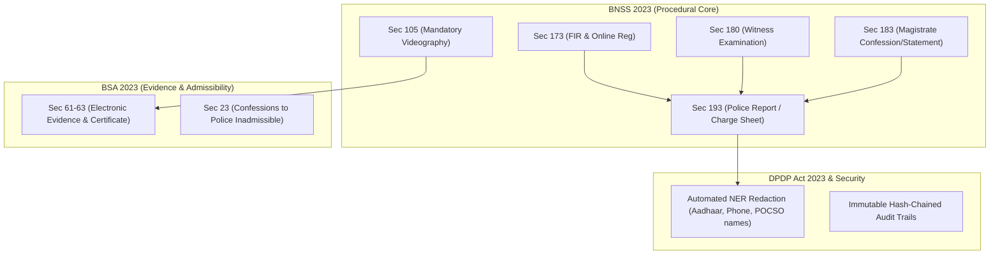
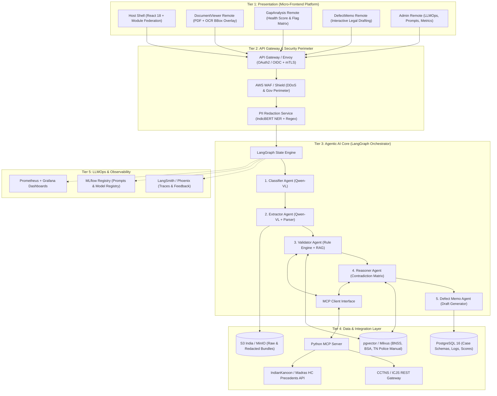
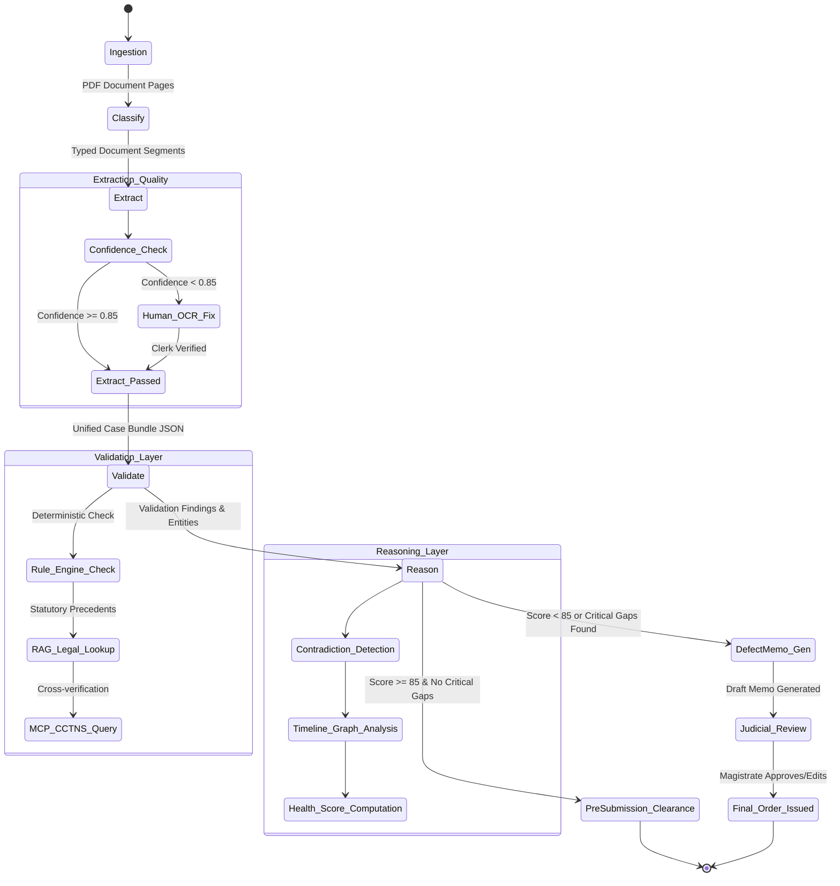
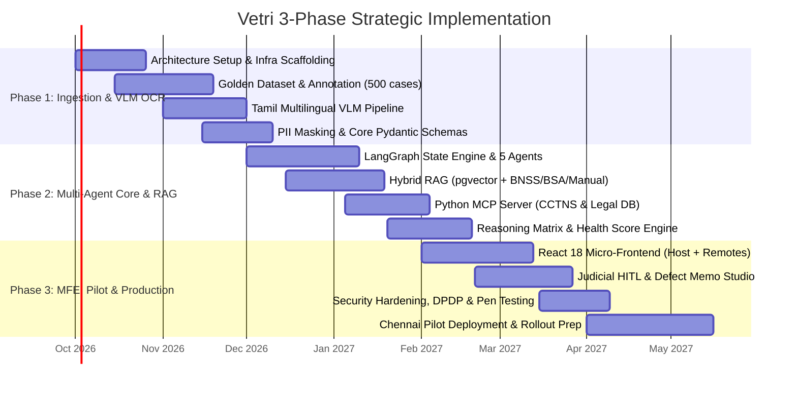

# Vetri (வெற்றி) — Police Cases Report Agent
## Comprehensive Project Requirements, Architecture Blueprint & 3-Phase Implementation Plan

---

### Executive Summary & Specialist Context

**Vetri (வெற்றி)** (`vetri-police-cases-report-agent`) is an enterprise-grade, government-compliant, bilingual (Tamil + English) Agentic AI system designed to automate the procedural scrutiny, gap detection, contradiction analysis, and defect memo drafting for police investigation dossiers submitted to judicial magistrates and district courts across Tamil Nadu.

Operating under the newly enacted criminal laws (**Bharatiya Nagarik Suraksha Sanhita 2023 [BNSS]**, **Bharatiya Sakshya Adhiniyam 2023 [BSA]**, **Bharatiya Nyaya Sanhita 2023 [BNS]**), the **Tamil Nadu Police Manual**, and the **Digital Personal Data Protection Act 2023 (DPDP)**, Vetri transforms an error-prone, weeks-long manual triage workflow into a 5-minute auditable verification loop with strict Human-in-the-Loop (HITL) judicial safeguards.

---

## 1. System Vision, Scope & Core Objectives

### 1.1 Problem Statement & Baseline Gaps
- **High Defect Rate**: Over 32% of charge sheets submitted to magistrates contain procedural infirmities (missing 183 BNSS confessions in serious offenses, unsigned seizure mahazars, delayed FIR dispatch under Sec 176 BNSS).
- **Delayed Feedback Loop**: Defect memos are traditionally drafted and served 14 to 30 days post-submission, stalling trials and prolonging custody/bail ambiguity.
- **Bilingual & Handwritten Complexity**: Up to 70% of lower-court case records in Tamil Nadu contain handwritten Tamil statements, regional Tamil legal jargon, and code-mixed Tanglish records.
- **Clerk Triage Bottleneck**: Court staff spend 35–50 minutes per case bundle manually cross-verifying dates, witness lists, and material object schedules.

### 1.2 Target KPIs (12-Month Horizon)
| Metric | Baseline (Manual) | Phase 1 Target | Phase 2 Target | Final Phase 3 (Prod) |
|---|---|---|---|---|
| **Charge Sheet Completeness Rate** | ~68% | 75% | 88% | ≥ 94% |
| **Defect Memo Turnaround Time** | 14–21 Days | 5 Days | 24 Hours | ≤ 2 Hours (Draft Ready) |
| **Clerk Triage Time per Case** | 40 Minutes | 25 Minutes | 12 Minutes | ≤ 5 Minutes |
| **AI Gap Detection Precision** | N/A | 80% | 88% | ≥ 92% |
| **AI Gap Detection Recall** | N/A | 75% | 85% | ≥ 90% |
| **Legal Citation Hallucination** | N/A | < 5% | < 1% | 0.0% (Deterministic RAG Grounding) |
| **PII Redaction Accuracy** | N/A | 95% | 99% | 99.9% (Zero DPDP Breaches) |

---

## 2. Legal & Statutory Alignment Matrix



### 2.1 Statutory Mapping Table
| Document Type | Governing Section | Validation Rules & Deterministic Triggers |
|---|---|---|
| **First Information Report (FIR)** | Sec 173 BNSS | Timestamps checked against occurrence time; jurisdictional police station verified; preliminary compliance check under Sec 176 BNSS (delay reporting). |
| **Scene Mahazar / Rough Sketch** | Sec 105 BNSS / TN Police Manual | Must contain witness signatures, date/time matching FIR, audio-video recording metadata verification under Sec 105 BNSS. |
| **Witness Statement** | Sec 180 BNSS (erstwhile 161 CrPC) | Verification of witness identifiers, cross-document timeline check, absence of police coercion disclaimers. |
| **Judicial Confession** | Sec 183 BNSS (erstwhile 164 CrPC) | Mandatory for POCSO / Rape / Heinous offenses; must be recorded by a Judicial Magistrate with statutory warning disclaimers. |
| **Seizure Mahazar / Property Form (Form 91)** | Sec 105 BNSS / TN Police Manual | Exact serial numbers, chain of custody verification, matching forensic lab (RFSL) requisition form. |
| **Medical / Post-Mortem Certificate** | Sec 193 & BSA Sec 45 | Doctor registration number, time of examination vs. occurrence, consistency with injury weapon in Seizure Mahazar. |
| **Final Report / Charge Sheet** | Sec 193 BNSS (erstwhile 173(2) CrPC) | Completeness check against 13 mandatory statutory columns, accused custody/bail status, legal section validation against BNS 2023. |

---

## 3. High-Level 5-Tier Enterprise Architecture



---

## 4. Multi-Agent Workflow & State Machine



### Agent Roster & Responsibility Matrix
1. **Classifier Agent**: Page-level visual classifier using `Qwen2-VL-72B-Instruct` / `Qwen2.5-VL-7B` recognizing Tamil headings, seal stamps, form structures (FIR Form 1, Mahazar, 180 Statement sheets).
2. **Extractor Agent**: Multimodal coordinate-aware extraction preserving exact bounding boxes (`[ymin, xmin, ymax, xmax]`), mapping handwritten/typed fields into typed Pydantic structures.
3. **Validator Agent**: Hybrid deterministic engine + LLM-RAG verifying mandatory document bundles against BNSS crime categories, police circulars, and time limitation rules (Sec 468 BNSS).
4. **Reasoner Agent**: Cross-document consistency matrix. Evaluates contradictions across:
   - *Timeline discrepancies*: FIR incident time vs. GD (General Diary) entry vs. Mahazar time.
   - *Physical weapon & injury mismatches*: Sharp-edged weapon seized vs. blunt-force trauma reported in post-mortem.
   - *Witness presence*: Witness claimed presence in Mahazar but absent in 180 BNSS list.
5. **Defect Memo Agent**: Formal judicial drafting agent generating formatted, numbered defect notifications referencing High Court circular formats and exact statutory violations.

---

## 5. Comprehensive 3-Phase Implementation Plan



---

### 🚀 PHASE 1: Data Foundations, Bilingual VLM Pipeline & Ingestion Architecture
**Duration**: Weeks 1 – 9 (Oct 1 – Nov 30, 2026)  
**Objective**: Establish cloud infra, curate the 500-case Golden Dataset, implement Tamil/English Multimodal OCR with bounding box coordinates, and set up PII redaction and Pydantic schemas.

#### Workstreams & Deliverables:
1. **Infra & Security Baseline**:
   - AWS India (`ap-south-1`) EKS clusters with GPU node groups (`g5.2xlarge` / `g6e.2xlarge` for VLMs).
   - S3 bucket encryption with AWS KMS (India residency locked), PostgreSQL 16 RDS instance with `pgvector` extension enabled.
   - PII Redaction Service utilizing fine-tuned `IndicBERT-NER` + regex pipeline to redact Aadhaar, PAN, phone numbers, and victim identity (mandatory for POCSO/BNS 72).
2. **Golden Dataset Curation**:
   - Compile and anonymize 500 real/synthetic TN Police case bundles covering:
     - Theft (`Sec 303 BNS`)
     - Hurt & Assault (`Sec 115 / 117 BNS`)
     - POCSO Act & Sexual Offenses (`Sec 64 / 70 BNS`)
     - Narcotic Cases (`NDPS Act`)
   - Dual-annotated ground-truth: Page classes, OCR bounding-box transcriptions (Tamil/English), extracted entities, rule defects, and verified contradictions.
3. **Multimodal Extraction Pipeline**:
   - `Qwen2.5-VL-7B` / `Qwen2-VL-72B` vision-language integration.
   - Bounding-box normalizer and coordinate mapper (`[ymin, xmin, ymax, xmax]`) stored alongside text tokens.
   - Document Classifier handling: FIR, Scene Mahazar, 180 Statements, 183 Confessions, Seizure Memos, Medical Reports, Charge Sheets.

#### Exit Criteria & Phase Gate:
- Document classification accuracy: $\ge 96\%$.
- Tamil handwritten character recognition Word Error Rate (WER): $\le 12\%$ on clean/semi-messy scanned records.
- PII Masking Precision & Recall: $\ge 99.5\%$.
- Fully validated Pydantic models for all 7 primary police document types.

---

### ⚡ PHASE 2: Agentic Multi-Agent Core, Hybrid RAG & MCP Integration
**Duration**: Weeks 9 – 18 (Dec 1, 2026 – Jan 31, 2027)  
**Objective**: Build the 5-agent LangGraph state machine, index the statutory legal knowledge base with pgvector hybrid search, deploy the MCP server, and implement the Case Health Scoring engine.

#### Workstreams & Deliverables:
1. **LangGraph State Orchestration**:
   - State graph containing `CaseState` with deterministic conditional edges and cyclic review paths.
   - Distributed state persistence using Redis checkpointer and PostgreSQL state history.
   - Circuit breakers for LLM timeouts, retries with exponential backoff, and low-confidence human routing.
2. **Hybrid RAG Knowledge Engine**:
   - Ingestion of full bare acts (BNSS, BSA, BNS 2023), legacy cross-walk tables (CrPC $\leftrightarrow$ BNSS, IPC $\leftrightarrow$ BNS), Tamil Nadu Police Manual (Volumes 1 & 2), and Madras High Court Criminal Rules of Practice.
   - Dense retrieval using `bge-multilingual-gemma2` / `text-embedding-3-large` + Sparse retrieval (BM25) with cross-encoder re-ranking (`bge-reranker-large`).
   - Citation grounding: Every rule validation or contradiction flag strictly linked to document page, bounding box, and statutory law section.
3. **Model Context Protocol (MCP) Server**:
   - Python-based MCP server (`mcp-server-vetri`) exposing JSON-RPC tools:
     - `cctns_lookup_accused_history`: Verify prior convictions/bad character registry.
     - `tn_police_manual_rule_lookup`: Retrieve mandatory investigation procedure guidelines.
     - `kanoon_precedent_search`: Query Madras HC rulings on procedural defect curability.
     - `fsl_report_status_check`: Verify pending chemical/forensic analysis.
4. **Reasoning & Case Health Scoring Matrix**:
   - Contradiction graph builder (temporal timeline analysis, spatial location mismatches, named entity discrepancies).
   - Weighted Case Health Score Engine:
     $$\text{Score} = w_1(\text{Doc Completeness}) + w_2(\text{Procedural Compliance}) + w_3(\text{Evidentiary Consistency}) + w_4(\text{Timeline Coherence})$$

#### Exit Criteria & Phase Gate:
- Zero hallucinated legal citations in automated evaluation suite (100% citation grounding against RAG chunks).
- Agent pipeline end-to-end execution time $\le 90$ seconds for a 50-page case bundle.
- Contradiction detection precision $\ge 88\%$, recall $\ge 85\%$.

---

### 🛡️ PHASE 3: Micro-Frontend UI, Judicial HITL Workflows, CCTNS & Pilot
**Duration**: Weeks 18 – 28 (Feb 1 – Apr 30, 2027)  
**Objective**: Deliver the React 18 Module Federation frontend with interactive bounding-box overlays, Judicial Defect Memo Studio, conduct rigorous security/DPDP compliance audits, and execute shadow pilot in Chennai District Courts.

#### Workstreams & Deliverables:
1. **Module Federation (MFE) Frontend Platform**:
   - Host Shell with centralized JWT authentication, RBAC routing (Investigating Officer, Court Clerk, Magistrate/Judge, System Admin).
   - **DocumentViewer Remote**: High-performance canvas-based PDF renderer with interactive color-coded bounding box overlays linking directly to AI flags.
   - **GapAnalysis Remote**: Interactive Case Health Score gauge, hierarchical drill-down into critical/major/minor defects.
   - **DefectMemo Remote**: Rich-text legal drafting studio pre-populated with AI findings, Madras HC defect templates, one-click PDF export and e-Court dispatch.
   - **Admin Remote**: Real-time LangSmith/Phoenix trace viewer, model latency metrics, prompt registry management.
2. **Human-in-the-Loop (HITL) Checkpoints**:
   - *Clerk Triage Queue*: One-click correction interface for low-confidence OCR fields.
   - *Investigating Officer Pre-Submission QA*: Self-service pre-check for IOs before submitting physical/e-dossiers to court.
   - *Magistrate Judicial Review*: Formal review, edit, and digital signature workflow for issuing Defect Return Orders.
3. **Security, Compliance & Penetration Testing**:
   - DPDP Act 2023 compliance verification: Data localization guarantee, audit log immutability, automated data erasure protocols for closed cases.
   - Cert-In certified third-party penetration testing and vulnerability assessment.
4. **Chennai District Court Shadow Pilot**:
   - Parallel shadow testing on 1,000 real-world submissions across 5 pilot police stations (T. Nagar, Mylapore, Flower Bazaar, Anna Nagar, Guindy) and 2 Magistrate Courts.
   - Weekly stakeholder review sessions with TN Police DGP Liaison and Judicial Officers.

#### Exit Criteria & Phase Gate:
- Clerk triage efficiency increased by $> 70\%$ (processing under 8 minutes per case).
- Judicial acceptance rate of auto-drafted Defect Memos $\ge 80\%$ with minimal edits.
- Formal sign-off on DPDP compliance and security audit.

---

## 6. Detailed Data Schemas & API Specifications

### 6.1 Pydantic Unified Case State Schema (`app/schemas/state.py`)
```python
from typing import List, Dict, Any, Optional, Literal
from pydantic import BaseModel, Field
from datetime import datetime

class BoundingBox(BaseModel):
    page: int
    ymin: float
    xmin: float
    ymax: float
    xmax: float

class Citation(BaseModel):
    document_type: str
    page_number: int
    bounding_box: Optional[BoundingBox] = None
    extracted_text: str
    legal_section: Optional[str] = None

class DefectFlag(BaseModel):
    flag_id: str
    severity: Literal["critical", "major", "minor", "info"]
    category: Literal[
        "missing_document",
        "procedural_violation",
        "timeline_contradiction",
        "evidentiary_mismatch",
        "statutory_non_compliance"
    ]
    title: str
    description: str
    legal_reference: str
    citations: List[Citation]
    remediation_step: str

class CategoryScores(BaseModel):
    document_completeness: float = Field(ge=0.0, le=100.0)
    procedural_compliance: float = Field(ge=0.0, le=100.0)
    evidentiary_consistency: float = Field(ge=0.0, le=100.0)
    timeline_coherence: float = Field(ge=0.0, le=100.0)

class CaseHealthScore(BaseModel):
    overall_score: float = Field(ge=0.0, le=100.0)
    category_scores: CategoryScores
    flags: List[DefectFlag]
    generated_at: datetime
    agent_version: str

class CaseState(BaseModel):
    case_id: str
    fir_number: str
    police_station: str
    submission_date: datetime
    raw_pdf_s3_uri: str
    classified_pages: List[Dict[str, Any]] = Field(default_factory=list)
    extracted_entities: Dict[str, Any] = Field(default_factory=dict)
    validation_results: List[Dict[str, Any]] = Field(default_factory=list)
    contradictions: List[Dict[str, Any]] = Field(default_factory=list)
    health_score: Optional[CaseHealthScore] = None
    draft_defect_memo: Optional[str] = None
    needs_human_review: bool = False
    review_reason: Optional[str] = None
    error_stack: Optional[List[str]] = None
```

---

## 7. Risk Register & Mitigation Strategy

| Risk ID | Description & Impact | Severity | Probability | Mitigation Strategy | Owner |
|---|---|---|---|---|---|
| **RSK-01** | **Tamil Cursive Handwriting OCR Failure**: Low scan quality / ancient ink leading to misreadings. | High | Medium | Multi-VLM ensemble (`Qwen2.5-VL` + fine-tuned `TrOCR-Tamil`); automated confidence scoring with seamless Clerk manual entry fallback. | Lead AI Engineer |
| **RSK-02** | **Code-Mixing / Tanglish Nuances**: Tamil legal idioms misinterpreted by generic LLMs. | High | High | Custom Tamil legal domain fine-tuning and few-shot RAG grounding with Madras HC terminology dictionaries. | NLP Specialist |
| **RSK-03** | **Judicial Skepticism & Adoption Resistance**: Judges distrusting AI recommendations. | Critical | Medium | "AI as Assistant" model. Strict citation transparency: every assertion shows the exact PDF bounding box. Zero automatic judgments. | Product Lead / SME |
| **RSK-04** | **Legacy CrPC $\leftrightarrow$ BNSS Transition Confusion**: Offenses committed before July 1, 2024 evaluated under wrong act. | High | Low | Automated date-of-offense classifier selecting the appropriate legal schema (CrPC/IPC for prior, BNSS/BNS for post July 1, 2024). | Legal Specialist |
| **RSK-05** | **DPDP Act Compliance & PII Exposure**: Accused / POCSO victim details leaked in logs or prompts. | Critical | Low | Air-gapped IndicBERT NER PII scrubbing before any vector embedding or LLM inference. Anonymized tenant-isolated DB. | Security Architect |
| **RSK-06** | **CCTNS API Outage / Network Latency**: External police database unavailable during validation. | Medium | Medium | Circuit breaker architecture with asynchronous background task queuing and graceful degradation. | Backend Lead |

---

## 8. Repository Layout & Target Workspace Structure

```
vetri-police-cases-report-agent/
├── README.md                          # Project root documentation & quickstart
├── project-requirement.md             # Complete requirements, architecture & 3-phase plan
├── docs/                              # Comprehensive architectural specs
│   ├── 01-PROJECT-VISION.md
│   ├── 02-USE-CASES.md
│   ├── 03-STAKEHOLDERS.md
│   ├── 04-LEGAL-FRAMEWORK.md
│   ├── 05-SYSTEM-ARCHITECTURE.md
│   ├── 06-AGENTIC-AI-WORKFLOW.md
│   ├── 07-RAG-PIPELINE.md
│   ├── 08-MCP-INTEGRATION.md
│   ├── 09-FRONTEND-ARCHITECTURE.md
│   ├── 10-AI-SDLC-LLMOPS.md
│   ├── 11-DATA-SCHEMAS.md
│   ├── 12-SECURITY-COMPLIANCE.md
│   ├── 13-EVALUATION-FRAMEWORK.md
│   ├── 14-PHASED-ROADMAP.md
│   ├── 15-RISKS-MITIGATIONS.md
│   └── 16-REFERENCES.md
├── backend/                           # Python 3.11+ FastAPI & LangGraph backend
│   ├── pyproject.toml
│   ├── app/
│   │   ├── main.py                    # FastAPI entrypoint & middleware
│   │   ├── core/                      # Config, security, logging
│   │   ├── schemas/                   # Pydantic state & entity schemas
│   │   ├── agents/                    # Classifier, Extractor, Validator, Reasoner, DefectMemo
│   │   ├── rag/                       # Hybrid retriever, embeddings, pgvector
│   │   ├── mcp/                       # Model Context Protocol server & tool bindings
│   │   └── api/                       # REST endpoints (cases, health, reviews)
│   └── tests/
├── frontend/                          # React 18 Module Federation UI
│   ├── shell/                         # Host application (Routing, Auth, Shared State)
│   ├── remotes/
│   │   ├── document-viewer/           # PDF viewer with OCR bounding-box overlay
│   │   ├── gap-analysis/              # Health score & defect flags dashboard
│   │   ├── defect-memo/               # Judicial memo editor & generator
│   │   └── admin/                     # LLMOps & prompt tuning console
│   └── package.json
└── infra/                             # Infrastructure-as-Code & deployment manifests
    ├── terraform/                     # AWS ap-south-1 EKS, S3, RDS, KMS
    ├── k8s/                           # Helm charts & Kubernetes manifests
    └── docker/                        # Production multi-stage Dockerfiles
```

---
*Authored by: Senior AI Solutions Architect & Engineering Manager | Vetri Project Steering Group*
